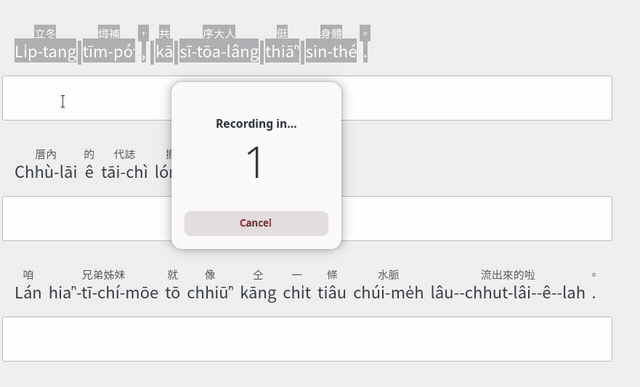
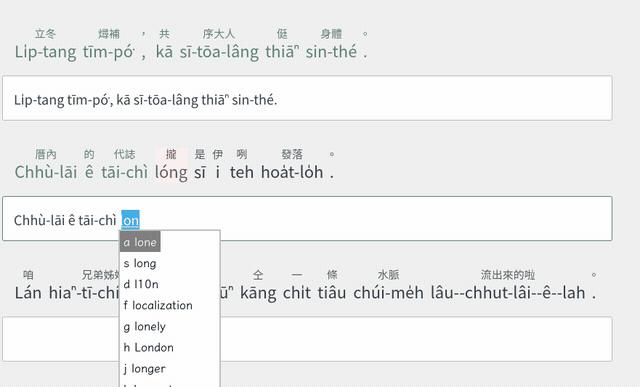
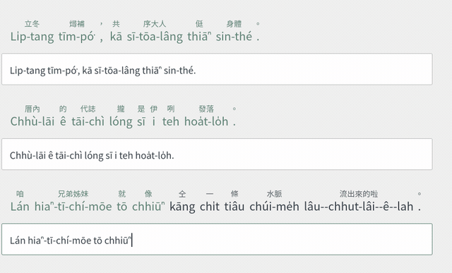

<p align="center">
  
</p>

# 拍台文 Phah Tai-bun

[](https://github.com/soanseng/rime-phah-taibun/releases)
[](LICENSE)
[](#)
[](#)
[](#)
[](https://soanseng.github.io/rime-phah-taibun/)
[](#支援平台)

Rime 台語輸入法方案 — 漢羅混寫輸出，POJ/TL 雙拼音系統，聲調可省略。

> **[使用說明 User Guide](https://soanseng.github.io/rime-phah-taibun/)**

專為「會講台語但不太會打台文」的人設計。不需要分辨 POJ 和 TL、不需要打聲調、不需要知道漢羅規則，輸入法全部幫你處理。

<p align="center">
  
</p>

## 特色

- **漢羅混寫**：依 LKK 李江却用字規範，自動輸出漢字+羅馬字混寫
- **POJ/TL 雙系統**：打 `tsiah` (TL) 或 `chiah` (POJ) 都能輸入「食」
- **聲調可省略**：打 `gua beh khi` 就能找到「我 beh 去」
- **拼音註解**：候選區永遠顯示讀音，邊打邊學
- **多種輸出模式**：漢羅TL、漢羅POJ、全羅TL、全羅POJ 一鍵切換
- **注音反查（華→台）**：不知道台語怎麼講？用注音打華語，選字後自動轉成台語候選
- **萬用查字**：拼音不確定？用 `?` 代替，先選音節再選字（二段式）
- **同音選字**：輸入後按 `'` 查同音字
- **造詞模式**：按 `;` + 拼音直接查字典選字
- **以詞定字**：按 `[` 取首字、`]` 取尾字，從詞組精準選字
- **長詞優先**：自動提升多字詞排序，減少逐字選字
- **推薦用字標記**：候選區顯示 ◆（推薦漢字）和 ★（推薦羅馬字），依 LKK 規範及教育部700字標示
- **Emoji 輸入**：候選區自動顯示相關 emoji（可開關）
- **英文混打**：直接打英文單字，台語英文無縫切換
- **輕聲自動辨識**：自動產生輕聲候選（如「轉--來」「食--飽」），29K+ 輕聲詞條 + 即時輕聲建議
- **170K 詞條**：整合 ChhoeTaigi 9 本辭典 + 7 語料庫頻率加權，涵蓋日常到文學用語

## 使用範例

### 基本輸入

```
輸入: gua beh khi tshit tho
候選: 我 beh 去 tshit-thô  [guá beh khì tshit-thô]
送出: 我 beh 去 tshit-thô
```

漢羅混寫自動處理：「我」「去」輸出漢字，「beh」「tshit-thô」依 LKK 規範輸出羅馬字。

<p align="center">
  
</p>

### POJ / TL 都可以打

```
TL 輸入:  tsiah png  → 食飯
POJ 輸入: chiah png  → 食飯（同樣結果）

TL 輸入:  gua ai li  → 我愛你
POJ 輸入: goa ai li  → 我愛你（同樣結果）
```

### 聲調完全可省

```
完整拼音: gua2 beh4 khi3  → 我 beh 去
省略聲調: gua beh khi     → 我 beh 去（同樣結果）

加聲調更精準:
to  → 多(1聲)、倒(2聲)、度(7聲)...（列出所有聲調）
to1 → 多、刀...（只列出第1聲）
```

### 注音反查（華→台）

按 `~` 進入反查模式，用注音找華語字，選字後自動轉成台語：


```
~ㄔ → 選「吃」→ 自動查到台語 tsiah8 → 出現「食」候選
~ㄏㄠˇ → 選「好」→ 自動查到台語 ho2 → 出現「好」候選
```

即使華語字不在台語字典裡（如「吃」→台語用「食」），內建 77K 筆華→台對照表也能正確轉換。

### 萬用查字 `?`（二段式）

不確定聲母？用 `?` 代替，先選音節再選字：


```
Step 1: ?iah → 列出可能的音節：
        tsiah (18字), siah (9字), liah (12字), giah (8字)...
Step 2: 選 tsiah → 出現所有 tsiah 的字：
        食、炸、即、脊、隻...
```

### 同音選字 `'`

輸入後按 `'` 查看同音字：


```
打 ho2 → 選「好」→ 按 ' → 顯示所有 ho2 的字
```

### 造詞模式 `;`

按 `;` + 拼音直接查字典：

```
;tsiah → 食、炸、即、脊、隻... (從字典查詢)
```

### 輕聲（Light Tone）

台語的輕聲會改變語意。輸入法自動辨識並提供輕聲候選：

```
輸入: au jit
候選: 後日 [āu-ji̍t]        ← 以後、將來
      後--日 [āu--ji̍t]     ← 後天（輕聲變體，自動產生）

輸入: tng lai
候選: 轉來 [tńg-lâi]       ← 回來
      轉--來 [tńg--lâi]    ← 回來（輕聲）
```

**輕聲規則**：台語中某些後綴詞（如「來」「去」「起來」等）在特定語法位置會失去原調，以 `--` 標記。例如：

| 原詞 | 輕聲形式 | 意思差異 |
|------|---------|---------|
| 後日 āu-ji̍t | 後--日 āu--ji̍t | 以後 → 後天 |
| 轉來 tńg-lâi | 轉--來 tńg--lâi | 回來（強調動作 → 輕聲語法） |
| 食飽 tsia̍h-pá | 食--飽 tsia̍h--pá | 吃飽（結果補語） |

輕聲候選來自兩個來源：
1. **字典內建**：29,000+ 筆輕聲詞條，從 7 個語料庫自動擷取
2. **即時產生**：根據 111 條輕聲規則（教育部資料），動態為候選詞加上輕聲變體

### 輸出模式切換

按 `F4` 或 `Ctrl+Shift+T` 切換：

| 模式 | 輸出範例 |
|------|---------|
| 漢羅 TL | 我 beh 去 tshit-thô |
| 漢羅 POJ | 我 beh 去 chhit-thô |
| 全羅 TL | guá beh khì tshit-thô |
| 全羅 POJ | goá beh khì chhit-thô |

### 推薦用字標記

候選區的註解會顯示推薦用字標記，幫助你選擇正確的書寫方式：

```
輸入: tsiah
候選: 食 ◆ [tsiah8]     ← ◆ 推薦用漢字

輸入: beh
候選: beh ★ [beh4]      ← ★ 推薦用羅馬字
```

| 標記 | 意義 | 來源 |
|------|------|------|
| ◆ | 推薦用漢字 | LKK 用字規範（type: han）或教育部700字 |
| ★ | 推薦用羅馬字 | LKK 用字規範（type: lo） |

標記只出現在候選區註解，不影響輸出文字。可在方案設定中關閉：

```yaml
phah_taibun_recommend:
  enabled: false
```

### 符號選單

按 `` ` `` (反引號) 開啟符號選單：

- 台羅調號：á à â ā a̍
- POJ 特殊字母：o͘ ⁿ
- 方音符號：ㆠ ㆣ ㄫ ㆢ ㆦ ㆤ
- 台文標點：、。「」『』

### 調符位置（Tone Diacritic Placement）

全羅模式輸出時，聲調符號自動標在正確的母音上，遵循[教育部台羅拼音方案使用手冊](https://language.moe.gov.tw/001/Upload/FileUpload/3677-15601/Documents/tshiutsheh_1081017.pdf)規則：

**TL 規則**：`a > oo > e > o`；`i` 和 `u` 同時出現時標在後者。

| 拼音 | 調符位置 | 說明 |
|------|---------|------|
| `gua2` | guá | 有 a → 標在 a |
| `ue2` | ué | 有 e → 標在 e |
| `io2` | ió | 有 o → 標在 o |
| `ui7` | uī | i,u 同時出現 → 標在後者 i |
| `iu5` | iû | i,u 同時出現 → 標在後者 u |
| `oo7` | ōo | oo 標在第一個 o |

**POJ 差異**：部分韻母的調符位置與 TL 不同：

| 韻母 | TL | POJ | 說明 |
|------|-----|-----|------|
| oa 開音節 | guā | gōa | 標 o |
| oa 有韻尾 | kuán | koán | 標 a |
| oa + ⁿ | khuàⁿ | khòaⁿ | 鼻化視同開音節，標 o |
| oe | hué | hōe | 標 o |
| ui | uī | ūi | 標前者 u |
| iu | iû | îu | 標前者 i |

### 台語日期

```
vvjit  → 2026年3月15 拜六
       → 2026 nî 3 gue̍h 15 Pài-la̍k
       → 2026-03-15
```

## 安裝

### 安裝需求

- **macOS**：鼠鬚管 ([Squirrel](https://github.com/rime/squirrel/releases))
- **Windows**：小狼毫 ([Weasel](https://github.com/rime/weasel/releases))
- **Linux**：fcitx5-rime 或 ibus-rime

### 手動安裝

1. 從 [Releases](https://github.com/soanseng/rime-phah-taibun/releases) 下載 zip 並解壓
2. 將 `schema/` 內的檔案複製到 Rime 使用者資料夾：
   - **macOS**：`~/Library/Rime/`
   - **Windows**：`%AppData%\Rime\`
   - **Linux (fcitx5)**：`~/.local/share/fcitx5/rime/`
   - **Linux (ibus)**：`~/.config/ibus/rime/`
3. 將 `lua/` 內的檔案複製到 Rime 使用者資料夾的 `lua/` 子目錄
4. 將 `rime.lua` 複製到 Rime 使用者資料夾根目錄（若已有 `rime.lua`，將內容追加合併）
5. 重新部署 Rime

### 指令安裝

#### macOS

打開終端機 (Terminal)，輸入以下指令：
```bash
curl -fsSL https://raw.githubusercontent.com/soanseng/rime-phah-taibun/main/scripts/install_macos.sh | bash
```

#### Windows

先安裝[小狼毫 (Weasel)](https://github.com/rime/weasel/releases)，然後打開 PowerShell，輸入以下指令：
```powershell
irm https://raw.githubusercontent.com/soanseng/rime-phah-taibun/main/install_windows.ps1 | iex
```

#### Linux

```bash
git clone https://github.com/soanseng/rime-phah-taibun.git
cd rime-phah-taibun
./install.sh
```

腳本會自動偵測 fcitx5-rime 或 ibus-rime，下載方案檔案、Lua 模組、芫荽字體，並觸發 Rime 重新部署。

### 建議字體

安裝 [芫荽 iansui](https://github.com/ButTaiwan/iansui) 可獲得最佳台文顯示效果（方音符號、特殊台文漢字）。安裝腳本會自動下載；也可從 [Releases](https://github.com/ButTaiwan/iansui/releases) 手動下載 `iansui.zip`。

安裝字體後，設定輸入法候選區使用 iansui：

<details>
<summary>Windows 小狼毫 weasel.custom.yaml</summary>

```yaml
patch:
  style/font_face: "Iansui"
  style/font_point: 14
```
</details>

<details>
<summary>macOS 鼠鬚管 squirrel.custom.yaml</summary>

```yaml
patch:
  style/font_face: "Iansui"
  style/font_point: 18
```
</details>

<details>
<summary>Linux fcitx5 classicui.conf</summary>

在 `~/.config/fcitx5/conf/classicui.conf` 加入：
```
Font="Iansui 12"
```
</details>

## 快捷鍵

| 按鍵 | 功能 | 說明 |
|------|------|------|
| `Ctrl+Space` | 台文/英文切換 | 切換台文和英文輸入模式 |
| `Tab` | 選字模式 / 音節跳轉 | 候選出現時：進入選字模式（asdf 選字，數字鍵保留給聲調）；否則：跳到下一個音節 |
| `Shift+字母` | 大寫字母 | 打大寫字母（不會切換到英文模式） |
| `F4` | 方案選單 | 切換輸出模式（漢羅TL/漢羅POJ/全羅TL/全羅POJ） |
| `~` | 注音反查 | 用注音打華語→自動轉台語候選 |
| `` ` `` | 符號選單 | 台羅調號、方音符號、台文標點 |
| `?` | 萬用查字 | 二段式：先選音節再選字 |
| `;` | 造詞模式 | 查字典選字（;拼音） |
| `'` | 同音選字 | 輸入後按 ' 查同音字 |
| `vvh` | 按鍵說明 | 在候選區顯示所有快捷鍵 |
| `vvjit` | 台語日期 | 輸出今天日期（漢字/羅馬字/ISO） |
| `vvsp` | 簡拼對照 | 顯示聲母縮寫對照表 |
| `[` | 以詞定字（首字） | 選取候選詞的第一個字 |
| `]` | 以詞定字（尾字） | 選取候選詞的最後一個字 |
| `\` | 切換輸出 | 漢羅模式→輸出全羅；全羅模式→輸出漢羅 |
| `Ctrl+Backspace` | 刪除音節 | 刪除前一個音節 |

## 疑難排解

### 安裝後找不到「拍台文」方案

1. 確認已重新部署 Rime
2. 按 `F4` 查看方案清單，確認「拍台文(台)」在列表中
3. 檢查 `~/.local/share/fcitx5/rime/default.custom.yaml` 是否包含 `phah_taibun`

### 候選區沒有顯示拼音註解

確認 Lua 模組已正確安裝：
```bash
ls ~/.local/share/fcitx5/rime/lua/phah_taibun_*.lua
```
應該要有 16 個 `phah_taibun_*.lua` 檔案。

### 注音反查 `~` 沒有反應

反查依賴 `bopomofo_tw` 方案，確認已安裝：
```bash
ls /usr/share/rime-data/bopomofo_tw.schema.yaml
```

若未安裝，安裝 `librime-data` 套件：
```bash
# Arch Linux
sudo pacman -S librime-data

# Ubuntu/Debian
sudo apt install librime-data-bopomofo
```

### Lua 錯誤導致候選區異常

查看 Rime 日誌：
```bash
cat /tmp/rime.*.INFO | grep -i "lua\|error"
```

若出現 Lua 載入錯誤，確認 `rime.lua` 已安裝到 Rime 使用者目錄根：
```bash
cat ~/.local/share/fcitx5/rime/rime.lua | grep phah_taibun
```

### 重新安裝

```bash
cd rime-phah-taibun
./install.sh
```

安裝腳本會更新所有檔案（不會覆蓋你的自訂詞庫）。

## 目錄結構

```
schema/                        Rime 方案檔（安裝到 Rime 使用者目錄）
  phah_taibun.schema.yaml        方案定義（speller algebra、engine 設定）
  phah_taibun.dict.yaml           主字典（170K 條目）
  phah_taibun_reverse.dict.yaml   反查字典（26K 條目）
  hanlo_rules.yaml                LKK 漢羅分類規則
  lighttone_rules.json            輕聲規則
  moe700.yaml                     教育部推薦700字台語漢字
  default.custom.yaml             Rime 方案註冊
lua/                           Lua 擴充模組（16 個）
  phah_taibun_filter.lua          核心：漢羅轉換 + 輸出模式切換 + 調符顯示
  phah_taibun_input.lua           大寫攔截 + Tab 選字模式
  phah_taibun_commit.lua          全羅輸出處理器 + \ 強制羅馬字
  phah_taibun_data.lua            漢羅規則載入器 + MOE 700字 + 聲調調符轉換 + 共用工具
  phah_taibun_lookup.lua          TL+POJ 雙標註
  phah_taibun_recommend.lua       推薦用字標記（◆ 漢字 / ★ 羅馬字）
  phah_taibun_select_char.lua     以詞定字（[ 首字、] 尾字）
  phah_taibun_long_word.lua       長詞優先排序
  phah_taibun_wildcard.lua        萬用字元 ?
  phah_taibun_symbols.lua         符號選單
  phah_taibun_help.lua            按鍵說明
  phah_taibun_date.lua            台語日期
  phah_taibun_phrase.lua          造詞模式
  phah_taibun_synonym.lua         文白讀切換（開發中）
  phah_taibun_speedup.lua         簡拼對照
rime.lua                       Lua 模組註冊（舊版 librime 相容）
scripts/                       Python 資料處理腳本（18 個）
tests/                         pytest 測試（18 個測試檔）
```

## 開發

### 從原始資料重新建置

若需要修改字典內容或更新詞頻：

```bash
# 安裝 Python 依賴
uv sync

# 下載外部資料（20 個語言資源，約 2GB）
./scripts/download_resources.sh

# 建置字典
uv run python scripts/build_all.py

# 重新安裝
./install.sh
```

### 測試

```bash
uv run pytest                                          # 跑測試
uv run pytest --cov=scripts --cov-report=term-missing  # 含覆蓋率
uv run ruff check scripts/ tests/                      # Lint
uv run ruff format scripts/ tests/                     # 格式化
```

### 新增 Lua 模組

1. 建立 `lua/phah_taibun_xxx.lua`（回傳 `{init, func}` table）
2. 在 `rime.lua` 加入 `phah_taibun_xxx = require("phah_taibun_xxx")`
3. 在 `schema/phah_taibun.schema.yaml` 的 engine 區加入對應的 `lua_translator` 或 `lua_filter`
4. 執行 `./install.sh` 部署

## 資料來源

| 資料 | 用途 |
|------|------|
| [ChhoeTaigi](https://github.com/ChhoeTaigi/ChhoeTaigiDatabase) | 主字典（iTaigi + 台華線頂） |
| [LKK 用字表](https://tsbp.tgb.org.tw/p/bong_8.html) | 漢羅轉換規則 |
| [教育部台語辭典](https://github.com/ChhoeTaigi/KipSutianDataMirror) | 反查字典（65K 條目） |
| [教育部辭典 (g0v)](https://github.com/g0v/moedict-data-twblg) | 反查字典 fallback |
| [iCorpus](https://github.com/Taiwanese-Corpus/icorpus_ka1_han3-ji7) | 詞頻統計（57K 詞） |
| [Ungian 2009](https://github.com/Taiwanese-Corpus/Ungian_2009_KIPsupin) | 文學語料詞頻（93K 詞） |
| [康軒課本](https://github.com/Taiwanese-Corpus/kok4hau7-kho3pun2) | 國小台語課本詞頻（1K 詞） |
| [常用900例句](https://github.com/Taiwanese-Corpus/Sin1pak8tshi7_2015_900-le7ku3) | 日常高頻詞彙（2.8K 詞） |
| [NMTL 文學作品](https://github.com/Taiwanese-Corpus/nmtl_2006_dadwt) | 台語文學語料（2K+ 篇） |
| [KipSutian 辭典](https://github.com/ChhoeTaigi/KipSutianDataMirror) | 例句語料 + 反查字典 |
| [白話字文獻](https://github.com/Taiwanese-Corpus/Khin-hoan_2010_pojbh) | 歷史 POJ 語料（POJ→TL 轉換） |
| [教育部臺灣台語推薦用字700字詞](https://mhi.moe.edu.tw/resource/TSMhiResource-000933/) | 推薦用字標記（◆ 漢字） |
| [yiufung/minnan-700](https://github.com/yiufung/minnan-700) | 教育部700字 CSV 格式資料 |
| [教育部台羅拼音方案使用手冊](https://language.moe.gov.tw/001/Upload/FileUpload/3677-15601/Documents/tshiutsheh_1081017.pdf) | 調符標記規則、羅馬字書寫規範 |
| [台語文拍字練習](https://kiantiong.com/taigi_typing/) | 線上台語打字練習，開發時用於驗證調符顯示與輸出效果 |
| [rime-liur](https://github.com/ryanwuson/rime-liur) | Lua 模組架構參考 |
| [rime-ice](https://github.com/iDvel/rime-ice) | UX 功能參考（以詞定字、長詞優先、emoji） |

## 致謝

- [李江却台語文教基金會](https://www.tgb.org.tw/) — 漢羅用字規範（LKK 用字表），為本方案的漢羅混寫輸出提供核心依據
- [ChhoeTaigi 找台語](https://chhoe.taigi.info/) — 整合多本辭典的開放資料平台
- [ryanwuson/rime-liur](https://github.com/ryanwuson/rime-liur) — Lua 模組架構參考
- [教育部臺灣台語常用詞辭典](https://sutian.moe.edu.tw/) — 反查字典資料
- [楊允言教授](http://ip194097.ntcu.edu.tw/Ungian/) — 台語文學語料庫與詞頻資料
- [Taiwanese-Corpus](https://github.com/Taiwanese-Corpus) — iCorpus、康軒課本、900例句、NMTL 文學、白話字文獻等語料
- [意傳科技 i3thuan5](https://github.com/i3thuan5) — 臺灣言語工具、分詞邏輯參考
- [iDvel/rime-ice](https://github.com/iDvel/rime-ice) — 以詞定字、長詞優先等 UX 功能參考

## 與其他台語輸入法的比較

目前桌面版台語輸入法主要有三套：

| 功能 | 拍台文 | 信望愛台語輸入法 | 教育部台語輸入法 |
|------|--------|-----------------|----------------|
| **平台** | Linux / macOS / Windows | Windows / macOS | Windows / macOS / 手機 |
| **Linux 支援** | fcitx5 + ibus | 無 | 無 |
| **開源** | MIT 授權 | 非開源 | 政府專案 |
| **輸入法引擎** | Rime（可自訂） | 自有引擎 | 自有引擎 |
| **拼音系統** | TL + POJ 雙系統 | TL + POJ | TL（自動轉換 POJ） |
| **聲調** | 完全可省略 | 需輸入 | 需輸入 |
| **漢羅混寫輸出** | 自動（LKK 規範） | 有 | 無（只有純漢字或純羅馬字） |
| **字典規模** | 170K 條目 | 未公開 | ~24K 條目 |
| **語料庫詞頻** | 7 語料庫加權 | 無 | 基本頻率 |
| **注音反查** | 華→台自動轉換 | 無 | 無 |
| **萬用查字** | ?（二段式） | 無 | 無 |
| **以詞定字** | [ 首字 ] 尾字 | 無 | 無 |
| **同音選字** | ' 鍵 | 無 | 無 |
| **Emoji** | 自動顯示 | 無 | 有 |
| **英文混打** | 內建 | 無 | 無 |
| **自訂擴充** | Lua 模組 | 無 | 無 |

### 拍台文的獨特優勢

1. **聲調可省略**：其他輸入法都要求輸入聲調數字，拍台文完全可以不打聲調
2. **漢羅混寫自動化**：依 LKK 規範自動判斷哪些字用漢字、哪些用羅馬字，使用者不需要自己決定
3. **華→台反查**：注音打華語字後，自動轉換成台語拼音再查台語字。內建 77K 筆對照表，即使「吃」→「食」這種不同字的轉換也能處理
4. **語料庫加權**：整合 7 個台語語料庫的詞頻資料，常用詞排更前面
5. **Linux 原生支援**：唯一支援 Linux（fcitx5/ibus）的台語桌面輸入法
6. **完全開源可自訂**：Rime + Lua 架構，可以自己修改規則和功能

### 適合誰用

- **會講台語但不太會打台文**：聲調可省、漢羅自動，降低打字門檻
- **台文寫作者**：LKK 漢羅規範、全羅模式、POJ/TL 切換
- **台語學習者**：拼音註解、注音反查、萬用查字，邊打邊學
- **Linux 使用者**：目前唯一的 Linux 台語桌面輸入法

> 想練習打台文？推薦到 [台語文拍字練習](https://kiantiong.com/taigi_typing/) 試試看，搭配拍台文輸入法一起使用，邊打邊熟悉台語拼音！

<p align="center">
  
</p>

## TODO

- [x] 製作 GIF 動畫教學（基本輸入、選字與候選、打字練習）
- [ ] 製作功能特寫 GIF（輸出模式切換、注音反查、萬用查字等）
- [ ] 文白讀切換功能（phah_taibun_synonym）

## 授權

詳見 [LICENSE](LICENSE)。
