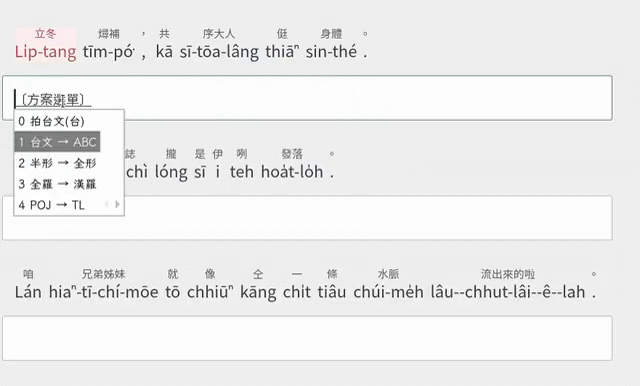

<p align="center">
  
</p>

# 寫台文 Siá Tâi-bûn

台語輸入法・Rime 的台語方案，佮仝一个網站的網頁試拍、轉換、寫作檢查、詞彙、文法工具，閣有檢定練習

> 寫台文（舊名：拍台文 Phah Tâi-bûn）。本專案佮「PhahTaigi 台語輸入法」是無仝的專案。

[](https://github.com/soanseng/rime-phah-taibun/releases)
[](LICENSE)
[](#)
[](#)
[](#)
[](https://taigi.anatomind.com/)
[](#安裝)

**台文** | [華文（臺灣）](#華文說明)

<p align="center">
  <a href="https://taigi.anatomind.com/demo/demo-part1.mp4" title="看示範影片：基本輸入"></a>
</p>

寫台文是開源的 Rime 台語輸入法：白話字 POJ、台羅 TL 作伙混拍，聲調先免拍，預設照 LKK 用字規範輸出漢羅，候選攏看會著讀音。專門做予「會曉講台語，毋過拍台文無熟」的人——免先揀拼音系統、免記漢羅規則，就會當開始寫。

> **緊入口**：[網站首頁](https://taigi.anatomind.com/) · [網頁試拍（免安裝）](https://taigi.anatomind.com/try/) · [練習・考試](https://taigi.anatomind.com/try/#practice) · [使用說明](https://taigi.anatomind.com/guide.html) · [快速上手小卡](docs/quickstart-card.md)

## 一个網站，一套詞典

寫台文毋但是輸入法。[taigi.anatomind.com](https://taigi.anatomind.com/) 頂懸的功能攏用仝一套詞典佮轉換核心——你佇轉換頁看著的讀音，就是輸入法候選看著的讀音。

| 功能 | 網址 | 做啥物 |
|------|------|--------|
| 安裝輸入法 | [#install](https://taigi.anatomind.com/#install) | Windows、macOS、Linux、Android，佇任何軟體拍台文 |
| 網頁試拍 | [/try/](https://taigi.anatomind.com/try/) | 免安裝，瀏覽器內就是真的 Rime 引擎（WebAssembly），精簡字典約 4.5 萬詞 |
| 練習・考試 | [/try/#practice](https://taigi.anatomind.com/try/#practice) | 看讀音拍、逐字標對錯；考試干焦看漢羅，10 句算分；題目有例句庫、詞語、閩南語維基百科／維基文庫、自訂文章；記錄存佇你家己的瀏覽器 |
| 聽寫練習 | [/try/#listen](https://taigi.anatomind.com/try/#listen) | 聽教典例句原音，用網頁試拍拍出漢羅抑是羅馬字 |
| 漢羅⇄羅馬字轉換 | [/convert/](https://taigi.anatomind.com/convert/) | 漢羅轉台羅 TL 佮白話字 POJ（連讀變調、輕聲、點字換讀音），POJ／TL 嘛會當倒轉漢字；附用字佮文法提示 |
| 寫作檢查 | [/check/](https://taigi.anatomind.com/check/) | 台羅、白話字、漢羅攏會用得：檢查拼音系統、調號、音節、連字符、推薦用字佮華語直譯，逐項有建議 |
| 檢定練習 | [/study/](https://taigi.anatomind.com/study/) | 推薦用字選擇、華語→台語造句、變調練習、弱點複習（間隔重複）、學習單列印；進度會當匯出備份 |
| 詞彙查詢 | [/vocab/](https://taigi.anatomind.com/vocab/) | 拍台語詞抑是華語意思，揣出 TL、POJ 佮教典例句 |
| 文法筆記 | [/grammar/](https://taigi.anatomind.com/grammar/) | 本站整理的台語文法筆記，佮 TGGL 語法點索引 |

轉換、詞彙、文法原本是姊妹站「讀台文」，2026 年 10 月已經併入本專案（`docs/convert/`、`docs/vocab/`、`docs/grammar/`，共用程式佮資料佇 `docs/thak/`）。

## 安裝

| 系統 | 安裝 | 愛先有 |
|------|------|--------|
| Windows | 下載 `PhahTaiBunSetup.exe` 雙擊安裝（電腦無小狼毫的話會順紲裝小狼毫 0.17.4，跳一擺系統管理員權限確認）；抑是先裝小狼毫，閣行 `irm https://raw.githubusercontent.com/soanseng/rime-phah-taibun/main/install_windows.ps1 \| iex` | — |
| macOS（best-effort，維護者無實機測試） | `curl -fsSL https://raw.githubusercontent.com/soanseng/rime-phah-taibun/main/scripts/install_macos.sh \| bash` | 鼠鬚管 Squirrel |
| Linux | `git clone https://github.com/soanseng/rime-phah-taibun.git && cd rime-phah-taibun && ./install.sh` | fcitx5-rime 抑 ibus-rime |
| Android | 對 Releases 下載一鍵包——`PhahTaiBun-Trime.zip`（寫台文＋注音）抑 `PhahTaiBun-Trime-liur.zip`（閣加嘸蝦米）——解壓縮到 Rime 使用者資料夾，重新部署，見[Android 部署](docs/android.md) | 同文 Trime，抑小企鵝 fcitx5-android＋RIME 外掛 |

裝好了後，先共系統輸入法切去小狼毫／鼠鬚管，閣按 `F4`（抑 `` Ctrl+` ``）確認方案清單有「寫台文(台)」。`F4` 愛 Rime 前端當咧用的時才有反應。macOS 無提供 `.pkg`（無法度驗證 Gatekeeper／notarize），請用頂懸的指令，抑共 `schema/`、`lua/`、`rime.lua` 囥入 `~/Library/Rime/` 重新部署。

Windows PowerShell 指令是互動式的：問你欲裝寫台文、嘸蝦米（`rime-liur`）抑兩項；動設定進前先共 `default.custom.yaml` 備份做 `default.custom.yaml.backup-<時間>`；問你欲留佗幾个既有方案（包括注音 `bopomofo`）。自動化執行會當用環境變數 `PHAH_TAIBUN_SCHEMAS`（`phah`／`liur`／`both`）佮 `PHAH_TAIBUN_PROJECT_ROOT`。腳本刻意**無存 BOM、無頂層 `param()`**：BOM 會綴 `irm` 入 `iex` 害解析失敗，所以 `PhahTaiBunSetup.exe` 嘛是用 UTF-8 讀檔閣 `iex`，參數用環境變數傳。

### 更新寫台文

- **Windows**：重新下載 `PhahTaiBunSetup.exe` 覆蓋安裝，抑重行 PowerShell 指令。
- **macOS**：重行 `curl … install_macos.sh | bash`。
- **Linux**：`cd rime-phah-taibun && git pull --ff-only && ./install.sh`
- **Android**：用上新的 `PhahTaiBun-Trime.zip` 覆蓋，重新部署，見[Android 部署](docs/android.md)。

更新會保留自訂詞庫、其他 Rime 方案佮設定，干焦換正式的寫台文方案、字典、規則佮 Lua 模組，上尾自動重新部署。輸出模式（TL/POJ、漢羅/全羅）會記咧，重開機嘛免重揀。

## 三分鐘上手

聲調免拍，TL 佮 POJ 會當混拍：

```text
gua beh khi tshit tho  →  我 beh 去 tshit-thô
tsiah png              →  食飯
chiah png              →  食飯
tai uan                →  臺灣 / 台灣
```

候選會顯示讀音，親像 `食飯 [tsia̍h-pn̄g]`。欲較準，才補聲調數字：`ho2`、`tai5 uan5`。

### 記這 8 个鍵

| 鍵 | 功能 |
|----|------|
| `Space` | 確認候選 |
| `Tab` | 候選出來時進入 asdf 揀字；拍字中跳下一个音節 |
| `F4` / `` Ctrl+` `` | 開 Rime 方案選單，切漢羅/全羅、TL/POJ、自動/手動漢羅 |
| `Ctrl+Space` | 台文／英文模式 |
| `~` | 注音反查：用注音拍華語，轉做台語候選 |
| `?` | 萬用查字，親像 `?iah` |
| `[` / `]` | 候選翻頁 |
| `\` | 目前候選換另外一種輸出形式 |

閣較濟鍵會當拍 `vvh` 看，抑看[快速上手小卡](docs/quickstart-card.md)。

### 進階：寫台文(Telex)

`F4` 選單內底閣有一个 **「寫台文(Telex)」**，予台羅熟、想欲手毋離字母鍵的人：聲調用字母鍵（`v`=2/8、`y`=3、`d`=5、`w`=7、`q`=9，`x`＝選配的 1/4 調），`z`→`ts`、`zh`→`tsh`，`f` 當音節連字號。伊佮「寫台文(台)」共用詞典、詞頻、使用者詞庫佮輸出模式：

```text
taid      == tai5     → 臺／台 [tâi]
taidfgiv  == tai5-gi2 → 台語 [tâi-gí]
ziahv     == tsiah8   → 食 [tsia̍h]
```

歷史、越南文對照佮鍵位理由見[完整使用說明](docs/user-guide.md#進階：寫台文telex-調鍵輸入)。

## 特色

- **漢羅混寫**：照 LKK 李江却用字規範，自動輸出漢字＋羅馬字；嘛有「手動漢羅」，家己用 `Tab`＋`\` 標佗一个詞寫羅馬字
- **POJ／TL 攏會通**：`tsiah`（TL）、`chiah`（POJ）攏揣會著「食」
- **聲調會當省**：拍 `gua beh khi` 就揣會著「我 beh 去」
- **整句拍、一擺送**：規句羅馬字拍了按空白鍵送出，半中途嘛會當 `Tab` 揀字
- **候選標讀音**：邊拍邊學；◆ 推薦漢字、★ 推薦羅馬字（LKK 規範、教育部 700 字）
- **四種輸出**：漢羅 TL、漢羅 POJ、全羅 TL、全羅 POJ，`F4` 切換
- **注音反查（華→台）**：毋知台語按怎講？用注音拍華語，揀字了自動轉台語候選（內建 7.7 萬筆華台對照）
- **萬用查字 `?`、同音揀字 `'`、造詞 `;`**：拼音無把握嘛揣會著字
- **輕聲**：自動生輕聲候選（「轉--來」「食--飽」），2.9 萬外筆輕聲詞＋111 條規則；嘛會當直接拍 `--`
- **字典外的詞**：候選上尾永遠有一个「羅馬字原文」，人名地名直接用
- **長詞優先、逐音節組字、個人化學習**：干焦學你揀過的詞，袂共輸入歷史自動變新詞
- **標點、符號、Emoji**：漢羅模式全形標點；`` ` `` 開 50 類符號，`` `e `` 揣 Emoji，拍「台灣」揀會著 🇹🇼
- **228,763 詞條**：ChhoeTaigi 9 本辭典、教育部辭典詞目、TL/POJ 全羅候選、7 个語料庫詞頻加權，閣有教育部輸入法詞庫增補、學科術語、臺灣地名

### 輸出模式

| 模式 | 輸出 |
|------|------|
| 漢羅 TL | 我 beh 去 tshit-thô |
| 漢羅 POJ | 我 beh 去 chhit-thô |
| 全羅 TL | guá beh khì tshit-thô |
| 全羅 POJ | góa beh khì chhit-thô |

全羅模式按 `Enter` 會照你拍的音直接送出帶調符的羅馬字（保留 `-`、`--`），適合人名、地名。調符位置照[教育部台羅拼音方案使用手冊](https://language.moe.gov.tw/001/Upload/FileUpload/3677-15601/Documents/tshiutsheh_1081017.pdf)；POJ 照 POJ 慣例（gōa、hōe、koán、khòaⁿ）。

### 全部快捷鍵

| 鍵 | 功能 | 說明 |
|----|------|------|
| `Ctrl+Space` | 台文/英文切換 | 英文候選未內建；按 `Ctrl+Space` 切去英文模式 |
| `Tab` | 揀字模式／跳音節 | 有候選：asdf 揀字（數字鍵留予聲調）；無：跳下一个音節 |
| `Shift+字母` | 大寫 | 毋免切英文模式 |
| `F4` | 方案選單 | 漢羅TL/漢羅POJ/全羅TL/全羅POJ、自動/手動漢羅 |
| `~` | 注音反查 | 注音拍華語→台語候選 |
| `,` `.` | 全形標點 | 漢羅：「，」「。」；全羅輸出半形 |
| `` ` `` | 符號選單 | 50 類，`` `25 `` 直達；`` `e `` Emoji 分類 |
| `?` | 萬用查字 | 先揀音節閣揀字 |
| `;` | 造詞模式 | `;拼音` 查字典 |
| `'` | 同音揀字 | 拍了按 `'` |
| `vvh` / `vvjit` / `vvsp` | 說明／台語日期／簡拼對照 | |
| `[` `]` | 翻頁 | 所有候選選單 |
| `\` | 換輸出 | 漢羅↔全羅 |
| `Enter` | 直接送出拍的音 | 全羅模式 |
| `Ctrl+Backspace` | 刪一个音節 | |

## 建議字型

裝[芫荽 Iansui](https://github.com/ButTaiwan/iansui) 會當看著上好的台文（𠢕、𤆬、𨑨迌 等推薦用字）。安裝腳本會自動下載；候選區字型設定見[使用說明](docs/user-guide.md)。

## 疑難排解

- **揣無「寫台文」方案**：確認系統輸入法切去 Rime、已經重新部署，按 `F4` 看清單；Linux 檢查 `default.custom.yaml` 有 `phah_taibun`。
- **候選無讀音註解**：確認 Rime 使用者資料夾的 `lua/` 有 21 个 `phah_taibun_*.lua`。
- **注音反查 `~` 無反應**：愛有 `bopomofo_tw` 方案（Arch：`rime-bopomofo`＋`rime-terra-pinyin`；Debian/Ubuntu：`librime-data-*`）。
- **Lua 錯誤**：看 Rime 日誌（Linux：`/tmp/rime.*.INFO`），確認 `rime.lua` 有囥佇使用者資料夾根目錄。
- **重新安裝**：重行安裝指令，袂蓋掉你的自訂詞庫。

## 佮其他台語輸入法比較

| 功能 | 寫台文 | 信望愛台語輸入法 | 教育部台語輸入法 |
|------|--------|-----------------|----------------|
| 平台 | Linux / macOS / Windows / Android（Trime） | Windows / macOS | Windows / macOS / 手機 |
| 開源 | MIT | 無開源 | 政府專案 |
| 拼音 | TL＋POJ 混拍 | TL＋POJ | TL（自動轉 POJ） |
| 聲調 | 會當攏免拍 | 愛拍 | 愛拍 |
| 漢羅輸出 | 自動（LKK 規範）＋手動 | 有 | 無 |
| 字典 | 228,763 條 | 無公開 | 約 2.4 萬條 |
| 華→台反查 | 有 | 無 | 無 |
| 網頁工具 | 試拍、練習、聽寫、轉換、寫作檢查、詞彙、文法、檢定練習 | 無 | 無 |

## 開發

```bash
uv sync                                   # Python 依賴
./scripts/download_resources.sh           # 外部資料（約 2GB）
uv run python scripts/build_all.py        # 建字典
./install.sh                              # 本機安裝

uv run pytest                             # 日常測試（真 librime 整合測試另外 -m real_rime）
uv run ruff check scripts/ tests/
python3 -m http.server 8000 --directory docs   # 網站本機預覽
```

詳細的專案規範佇 [AGENTS.md](AGENTS.md)，技術規劃佇 [PLAN.md](PLAN.md)。

### 目錄

```
schema/        Rime 方案（主方案、Telex、主字典、LKK 漢羅規則、輕聲規則、教育部 700 字）
lua/           Lua 擴充模組（21 個）
opencc/        Emoji 詞語候選資料（rime-emoji）
rime.lua       Lua 模組註冊（舊版 librime 相容）
scripts/       資料處理腳本；scripts/thak/ 是網頁工具的資料管線
docs/          網站：首頁、try/ 試拍佮練習、convert/ vocab/ grammar/ 工具頁、使用說明
tests/         pytest 測試（tests/js/ 是網頁練習的 node 測試）
```

## 資料來源佮致謝

詞典資料逐來源標示授權，詳細見 [LICENSE](LICENSE) 佮 [AGENTS.md](AGENTS.md)。

- [李江却台語文教基金會](https://www.tgb.org.tw/) — LKK 用字表，漢羅輸出的核心根據
- [ChhoeTaigi 找台語](https://chhoe.taigi.info/) — 9 本辭典的開放資料
- [教育部臺灣台語常用詞辭典](https://sutian.moe.edu.tw/) — 主字典、注音反查讀音、例句
- [楊允言教授](http://ip194097.ntcu.edu.tw/Ungian/) — 台語文學語料佮詞頻
- [Taiwanese-Corpus](https://github.com/Taiwanese-Corpus) — iCorpus、康軒課本、900 例句、NMTL 文學、白話字文獻
- [luke871016/Taigi-Input-method-dictionary-supplement](https://github.com/luke871016/Taigi-Input-method-dictionary-supplement) — 教育部輸入法詞庫增補
- [ryanwuson/rime-liur](https://github.com/ryanwuson/rime-liur) — Lua 模組架構參考
- [iDvel/rime-ice](https://github.com/iDvel/rime-ice) — 長詞優先等 UX 參考
- [rime/rime-emoji](https://github.com/rime/rime-emoji) — Emoji 候選資料（LGPL-3.0）
- [意傳科技 i3thuan5](https://github.com/i3thuan5) — 臺灣言語工具、KeSi POJ↔TL
- [My RIME](https://github.com/LibreService/my_rime) — 網頁試拍的 Rime WebAssembly 引擎（AGPL-3.0-or-later）

## 授權

程式碼 MIT；詞典資料照各來源條款（含非商用來源），見 [LICENSE](LICENSE)。

---

## 華文說明

[台文](#寫台文-siá-tâi-bûn) | **華文（臺灣）**

寫台文是開源的 Rime 台語輸入法：白話字 POJ、台羅 TL 可以混打，聲調可以省略，預設依 LKK 用字規範輸出漢羅，候選區一律顯示讀音。專為「會說台語，但不太會打台文」的人設計——不必先選拼音系統、不必記漢羅規則，就能開始寫。

> **快速入口**：[網站首頁](https://taigi.anatomind.com/) · [網頁試打（免安裝）](https://taigi.anatomind.com/try/) · [練習・考試](https://taigi.anatomind.com/try/#practice) · [使用說明](https://taigi.anatomind.com/guide.html) · [快速上手小卡](docs/quickstart-card.md)

### 一個網站，一套詞典

寫台文不只是輸入法。[taigi.anatomind.com](https://taigi.anatomind.com/) 上的各項功能都使用同一套詞典與轉換核心——你在轉換頁看到的讀音，就是輸入法候選裡的讀音。

| 功能 | 網址 | 用途 |
|------|------|------|
| 安裝輸入法 | [#install](https://taigi.anatomind.com/#install) | Windows、macOS、Linux、Android，在任何軟體打台文 |
| 網頁試打 | [/try/](https://taigi.anatomind.com/try/) | 免安裝，瀏覽器裡就是真正的 Rime 引擎（WebAssembly），精簡字典約 4.5 萬詞 |
| 練習・考試 | [/try/#practice](https://taigi.anatomind.com/try/#practice) | 看讀音打字、逐字標示對錯；考試只看漢羅，10 句計分；題目有例句庫、詞語、閩南語維基百科／維基文庫、自訂文章；紀錄存在你自己的瀏覽器 |
| 聽寫練習 | [/try/#listen](https://taigi.anatomind.com/try/#listen) | 聽教典例句原音，用網頁試打打出漢羅或羅馬字 |
| 漢羅⇄羅馬字轉換 | [/convert/](https://taigi.anatomind.com/convert/) | 漢羅轉台羅 TL 與白話字 POJ（連讀變調、輕聲、點字換讀音），也能把 POJ／TL 轉回漢字；附用字與文法提示 |
| 寫作檢查 | [/check/](https://taigi.anatomind.com/check/) | 台羅、白話字、漢羅都能用：檢查拼音系統、調號、音節、連字號、推薦用字與華語直譯，逐項給建議 |
| 檢定練習 | [/study/](https://taigi.anatomind.com/study/) | 推薦用字選擇、華語→台語造句、變調練習、弱點複習（間隔重複）、學習單列印；進度可匯出備份 |
| 詞彙查詢 | [/vocab/](https://taigi.anatomind.com/vocab/) | 輸入台語詞或華語意思，查出 TL、POJ 與教典例句 |
| 文法筆記 | [/grammar/](https://taigi.anatomind.com/grammar/) | 本站整理的台語文法筆記，以及 TGGL 語法點索引 |

轉換、詞彙、文法原本是姊妹站「讀台文」，已於 2026 年 10 月併入本專案。

### 安裝

| 系統 | 安裝 | 需要先有 |
|------|------|----------|
| Windows | 下載 `PhahTaiBunSetup.exe` 雙擊安裝（沒有小狼毫會自動一起安裝 0.17.4，跳出一次系統管理員權限確認）；或先裝小狼毫，再執行 `irm https://raw.githubusercontent.com/soanseng/rime-phah-taibun/main/install_windows.ps1 \| iex` | — |
| macOS（best-effort，維護者未實機測試） | `curl -fsSL https://raw.githubusercontent.com/soanseng/rime-phah-taibun/main/scripts/install_macos.sh \| bash` | 鼠鬚管 Squirrel |
| Linux | `git clone https://github.com/soanseng/rime-phah-taibun.git && cd rime-phah-taibun && ./install.sh` | fcitx5-rime 或 ibus-rime |
| Android | 從 Releases 下載一鍵包——`PhahTaiBun-Trime.zip`（寫台文＋注音）或 `PhahTaiBun-Trime-liur.zip`（再加嘸蝦米）——解壓到 Rime 使用者資料夾後重新部署，見[Android 部署](docs/android.md) | 同文 Trime，或小企鵝 fcitx5-android＋RIME 外掛 |

安裝後先把系統輸入法切到小狼毫／鼠鬚管，再按 `F4`（或 `` Ctrl+` ``）確認方案清單中有「寫台文(台)」。macOS 不提供 `.pkg`（無法驗證 Gatekeeper／notarize），請用上方指令，或把 `schema/`、`lua/`、`rime.lua` 複製到 `~/Library/Rime/` 後重新部署。

Windows PowerShell 指令為互動式：詢問要裝寫台文、嘸蝦米（`rime-liur`）或兩者；修改設定前先把 `default.custom.yaml` 備份為 `default.custom.yaml.backup-<時間戳>`；並詢問要保留哪些既有方案（含注音 `bopomofo`）。非互動執行可設環境變數 `PHAH_TAIBUN_SCHEMAS`（`phah`／`liur`／`both`）與 `PHAH_TAIBUN_PROJECT_ROOT`。

### 更新寫台文

- **Windows**：重新下載 `PhahTaiBunSetup.exe` 覆蓋安裝，或重新執行 PowerShell 指令。
- **macOS**：重新執行 `curl … install_macos.sh | bash`。
- **Linux**：`cd rime-phah-taibun && git pull --ff-only && ./install.sh`
- **Android**：用最新 `PhahTaiBun-Trime.zip` 覆蓋後重新部署，見[Android 部署](docs/android.md)。

更新會保留自訂詞庫、其他 Rime 方案與設定，只更新正式的寫台文方案、字典、規則與 Lua 模組，最後自動重新部署。輸出模式（TL/POJ、漢羅/全羅）會被記住。

### 三分鐘上手

不用打聲調，TL 與 POJ 可以混打：

```text
gua beh khi tshit tho  →  我 beh 去 tshit-thô
tsiah png              →  食飯
chiah png              →  食飯
tai uan                →  臺灣 / 台灣
```

候選區會顯示讀音，例如 `食飯 [tsia̍h-pn̄g]`。想更精準時再補聲調數字：`ho2`、`tai5 uan5`。另有可選的 **「寫台文(Telex)」** 方案（`F4` 切換），用字母鍵標調：`taidfgiv` → 台語、`ziahv` → 食。

| 按鍵 | 用途 |
|------|------|
| `Space` | 確認候選 |
| `Tab` | 候選出現時進入 asdf 選字；打字中跳下一音節 |
| `F4` / `` Ctrl+` `` | 開 Rime 方案選單，切換漢羅/全羅、TL/POJ、自動/手動漢羅 |
| `Ctrl+Space` | 台文／英文模式（英文候選未內建；按 `Ctrl+Space` 切至英文模式） |
| `~` | 注音反查華語，再轉台語候選 |
| `?` | 萬用查字，例如 `?iah` |
| `[` / `]` | 候選翻頁 |
| `\` | 目前候選改用另一種輸出形式 |

更多按鍵可直接打 `vvh`，或看[快速上手小卡](docs/quickstart-card.md)與[完整使用說明](docs/user-guide.md)。

### 特色

- **漢羅混寫**：依 LKK 李江却用字規範自動輸出漢字＋羅馬字；另有「手動漢羅」，用 `Tab`＋`\` 自行標記哪個詞寫羅馬字
- **POJ／TL 雙系統**：`tsiah`（TL）、`chiah`（POJ）都能找到「食」
- **聲調可省略**：打 `gua beh khi` 就能找到「我 beh 去」
- **整句輸入**：整句羅馬字打完按空白鍵送出，中途可用 `Tab` 選字
- **候選標示讀音**：邊打邊學；◆ 推薦漢字、★ 推薦羅馬字（LKK 規範、教育部 700 字）
- **注音反查（華→台）**：用注音打華語，選字後自動轉成台語候選（內建 7.7 萬筆華台對照）
- **萬用查字 `?`、同音選字 `'`、造詞 `;`**
- **輕聲**：自動產生輕聲候選，2.9 萬筆以上輕聲詞＋111 條規則
- **字典外的詞**：候選最後永遠有「羅馬字原文」候選
- **標點、符號、Emoji**：漢羅模式全形標點；`` ` `` 開 50 類符號，`` `e `` 瀏覽 Emoji
- **228,763 詞條**：ChhoeTaigi 9 本辭典、教育部辭典、7 個語料庫詞頻加權，以及教育部輸入法詞庫增補、學科術語、臺灣地名

### 與其他台語輸入法比較

| 功能 | 寫台文 | 信望愛台語輸入法 | 教育部台語輸入法 |
|------|--------|-----------------|----------------|
| **平台** | Linux / macOS / Windows / Android（Trime） | Windows / macOS | Windows / macOS / 手機 |
| **開源** | MIT 授權 | 非開源 | 政府專案 |
| **拼音系統** | TL＋POJ 混打 | TL＋POJ | TL（自動轉換 POJ） |
| **聲調** | 完全可省略 | 需輸入 | 需輸入 |
| **漢羅混寫輸出** | 自動（LKK 規範）＋手動 | 有 | 無 |
| **字典規模** | 228,763 條目 | 未公開 | 約 2.4 萬條目 |
| **注音反查** | 華→台自動轉換 | 無 | 無 |
| **Emoji** | 內建 [rime-emoji](https://github.com/rime/rime-emoji)（LGPL-3.0）：詞語附加候選＋分類瀏覽（含 🇹🇼） | 無 | 有 |
| **英文候選** | 未內建；按 `Ctrl+Space` 切至英文模式 | 無 | 無 |
| **網頁工具** | 試打、練習、聽寫、轉換、寫作檢查、詞彙、文法、檢定練習 | 無 | 無 |

### 疑難排解

- **找不到「寫台文」方案**：確認系統輸入法已切到 Rime、已重新部署，按 `F4` 查看清單。
- **候選區沒有讀音註解**：Rime 使用者資料夾的 `lua/` 應有 21 個 `phah_taibun_*.lua`（Lua 擴充模組共 21 個）。
- **注音反查 `~` 沒反應**：需要 `bopomofo_tw` 方案（Arch：`rime-bopomofo`＋`rime-terra-pinyin`；Debian/Ubuntu：`librime-data-*`）。
- **重新安裝**：重新執行安裝指令，不會覆蓋自訂詞庫。

### 授權

程式碼採 MIT；詞典資料依各來源條款（含非商用來源），詳見 [LICENSE](LICENSE)。
