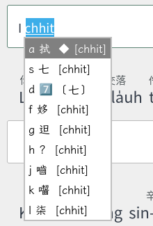

# 拍台文 Phah Tai-bun 使用說明

**Rime 台語輸入法方案** — 漢羅混寫輸出，POJ/TL 雙拼音系統，聲調可省略。

專為「會講台語但不太會打台文」的人設計。不需要分辨 POJ 和 TL、不需要打聲調、不需要知道漢羅規則，輸入法全部幫你處理。

第一次使用可以先看[快速上手小卡](quickstart-card.md)：安裝、第一句練習、常用快捷鍵和基本排錯都整理在一頁。

<video src="demo/demo-part1.mp4" controls muted playsinline preload="metadata" aria-label="拍台文打字示範：基本輸入" style="max-width:100%;border-radius:8px"></video>

---

## 一、安裝方式

### 安裝需求

- **macOS**：鼠鬚管 ([Squirrel](https://github.com/rime/squirrel/releases))
- **Windows**：小狼毫 ([Weasel](https://github.com/rime/weasel/releases))
- **Linux**：fcitx5-rime 或 ibus-rime
- **Android（社群維護）**：同文 Trime，或 fcitx5-android + RIME 外掛；用 Releases 的 `PhahTaiBun-Trime.zip` 一鍵包。步驟見[Android 部署](android.md)

### 一般使用者：Windows 安裝包／macOS 指令

Windows 從 [Releases](https://github.com/soanseng/rime-phah-taibun/releases) 下載安裝包；macOS 與 Linux 用指令（不提供 `.pkg`）：

| 系統 | 方式 | 說明 |
|------|------|------|
| Windows | `PhahTaiBunSetup.exe` | 雙擊安裝。若尚未安裝小狼毫，安裝器會提示先安裝 Weasel。 |
| macOS | `curl -fsSL https://raw.githubusercontent.com/soanseng/rime-phah-taibun/main/scripts/install_macos.sh \| bash` | 先裝鼠鬚管。也可 `git clone` 後 `./install.sh`，或把 `schema/`、`lua/`、`rime.lua` 複製到 `~/Library/Rime/` 後重新部署。 |

Windows 安裝包仍使用 Rime 作為輸入法核心，不用手動複製檔案。安裝器會保留既有 Rime 輸入法、自訂詞庫和 `rime.lua`。

安裝完成後，要分兩層切換。拍台文**不是**系統輸入法清單裡的獨立項目；系統層先進入小狼毫／鼠鬚管，進到 Rime 之後，才用方案選單選「拍台文(台)」。

1. **先把系統輸入法切到小狼毫或鼠鬚管**，不要停在微軟注音、微軟拼音或 ABC。
   - **Windows**：工作列語言圖示選【小狼毫】。圖示常顯示【中】，但微軟注音／拼音也常顯示【中】——請確認選到的是小狼毫，不是微軟輸入法。切換方式見 [Microsoft 說明：管理工作列輸入法](https://support.microsoft.com/zh-tw/windows/hardware/input-devices/manage-the-language-and-keyboard-input-layout-settings-in-windows) 與 [小狼毫 README](https://github.com/rime/weasel)。
   - **macOS**：選單列輸入法選【鼠鬚管】，圖示是【ㄓ】。切換方式見 [Apple 說明：切換輸入方式](https://support.apple.com/zh-tw/guide/mac-help/mchlp1406/mac) 與 [鼠鬚管 README](https://github.com/rime/squirrel)。
   - **Linux**：切到 fcitx5-rime 或 ibus-rime。
2. 重新部署 Rime（小狼毫／鼠鬚管選單 → 重新部署）。
3. 點進任何可打字的欄位，按 `F4` 或 `` Ctrl+` `` 打開 Rime 方案選單，選「拍台文(台)」；熟台羅、想用調鍵連續輸入的人可改選「拍台文(Telex)」。`` ` `` 在數字 `1` 左邊。

> `F4` 只有在已經進入小狼毫／鼠鬚管時才會有反應。按了沒變化，先看工作列／選單列是不是小狼毫【中】或鼠鬚管【ㄓ】；筆電可能要按 `Fn+F4`，或改試 `` Ctrl+` ``。官方說明：[Rime 方案選單](https://github.com/rime/home/wiki/UserGuide#%E4%BD%BF%E7%94%A8%E6%96%B9%E6%A1%88%E9%81%B8%E5%96%AE)。

### 進階使用者：指令安裝

#### macOS

打開終端機 (Terminal)，輸入以下指令：
```bash
curl -fsSL https://raw.githubusercontent.com/soanseng/rime-phah-taibun/main/scripts/install_macos.sh | bash
```

#### Windows

先安裝[小狼毫 (Weasel)](https://github.com/rime/weasel/releases)，然後打開 PowerShell，輸入以下指令：
```powershell
irm https://raw.githubusercontent.com/soanseng/rime-phah-taibun/main/install_windows.ps1 | iex
```

指令安裝是互動式的：

- **選方案**：`1` 拍台文、`2` 嘸蝦米（`rime-liur`）、`3` 兩者（預設，直接按 Enter）。選到嘸蝦米時再選完整版（含英文詞庫）或基礎版。
- **先備份**：動任何設定前，把 `default.custom.yaml` 複製成 `default.custom.yaml.backup-<時間戳>`。
- **保留既有輸入法**：列出目前的方案清單，讓你挑要保留哪些（Enter＝全部保留）；若清單裡沒有注音 `bopomofo`，會問要不要一併留下。
- **只追加不取代**：既有方案清單與自訂詞庫不會被蓋掉。嘸蝦米檔案即時從 [soanseng/rime-liur-arch](https://github.com/soanseng/rime-liur-arch) 下載（第三方方案，授權依原 repo）。

要非互動執行（自動化）可設環境變數：`PHAH_TAIBUN_SCHEMAS`（`phah`／`liur`／`both`）與 `PHAH_TAIBUN_PROJECT_ROOT`。雙擊安裝的 `PhahTaiBunSetup.exe` 以 `PHAH_TAIBUN_SCHEMAS=phah` 非互動執行。

腳本刻意**不存 BOM、也不放頂層 `param()`**：BOM 會被 GitHub raw 與 `irm` 帶進 `iex`，黏在第一個 token 上造成解析失敗（`At line:6 char:28 ... $ProjectRoot = "",`）。若你自行修改腳本，請保持無 BOM。

#### Linux

```bash
git clone https://github.com/soanseng/rime-phah-taibun.git
cd rime-phah-taibun
./install.sh
```

腳本會自動偵測 fcitx5-rime 或 ibus-rime，下載方案檔案、Lua 模組、芫荽字體，並觸發 Rime 重新部署。

### 更新拍台文

- **Windows 安裝包**：到 [GitHub Releases](https://github.com/soanseng/rime-phah-taibun/releases) 下載最新版 `PhahTaiBunSetup.exe` 覆蓋安裝。
- **Windows PowerShell／macOS 終端機**：重新執行上方原本的安裝指令。
- **Linux**：在既有 clone 內執行：

```bash
cd rime-phah-taibun
git pull --ff-only
./install.sh
```

- **Android**：用最新 `PhahTaiBun-Trime.zip` 覆蓋後重新部署（或只覆蓋正式的 `phah_taibun*` 方案檔與 `lua/phah_taibun_*.lua`）。不要覆蓋自訂詞庫。見[Android 部署](android.md#更新)。

更新會保留 `phah_taibun.custom.dict.yaml`、`phah_taibun.phrase.dict.yaml` 等自訂詞庫、其他 Rime 輸入方案與設定；正式的拍台文 schema、主字典、規則檔和 Lua 模組會更新，安裝器完成後會自動重新部署 Rime。


每個 Release 都附 `SHA256SUMS`（涵蓋所有安裝資產），想核對下載完整性可看[安裝包說明](packaged-installers.md#驗證下載0720-起)。

> 若你直接修改過正式的 `phah_taibun` 檔案，更新前請先備份。長期自訂建議放在 Rime custom patch 或自訂詞庫，避免下次更新被正式檔案取代。

### 手動安裝

1. 從 [Releases](https://github.com/soanseng/rime-phah-taibun/releases) 下載 zip 並解壓
2. 將 `schema/` 內的檔案複製到 Rime 使用者資料夾：
   - **macOS**：`~/Library/Rime/`
   - **Windows**：`%AppData%\Rime\`
   - **Linux (fcitx5)**：`~/.local/share/fcitx5/rime/`
   - **Linux (ibus)**：`~/.config/ibus/rime/`
   - **Android**：同文或 fcitx5-android 的 Rime 使用者資料夾，見[Android 部署](android.md)
3. 將 `lua/` 內的檔案複製到 Rime 使用者資料夾的 `lua/` 子目錄
4. 將 `rime.lua` 複製到 Rime 使用者資料夾根目錄（若已有 `rime.lua`，將內容追加合併）
5. 重新部署 Rime

### 建議字體

安裝 [芫荽 iansui](https://github.com/ButTaiwan/iansui) 可獲得最佳台文顯示效果（方音符號、特殊台文漢字）。安裝腳本會自動下載；也可從 [Releases](https://github.com/ButTaiwan/iansui/releases) 手動下載 `iansui.zip`。

安裝字體後，設定輸入法候選區使用 iansui 字體：

#### 小狼毫 Weasel（Windows）

建立或編輯 `%AppData%\Rime\weasel.custom.yaml`：

```yaml
patch:
  style/font_face: "Iansui"
  style/font_point: 14
```

#### 鼠鬚管 Squirrel（macOS）

建立或編輯 `~/Library/Rime/squirrel.custom.yaml`：

```yaml
patch:
  style/font_face: "Iansui"
  style/font_point: 18
```

#### fcitx5（Linux）

在 `~/.config/fcitx5/conf/classicui.conf` 加入：

```
Font="Iansui 12"
```

儲存後右鍵系統匣圖示 → 重新部署。

---

## 二、基本輸入



### 台語拼音輸入

用台語拼音打字，候選區會列出漢字和羅馬字的候選：

```
輸入: gua beh khi tshit tho
候選: 我 beh 去 tshit-thô  [guá beh khì tshit-thô]
送出: 我 beh 去 tshit-thô
```

漢羅混寫自動處理：「我」「去」輸出漢字，「beh」「tshit-thô」依 LKK 規範輸出羅馬字。

### POJ 和 TL 都通

拍台文同時支援 POJ（白話字）和 TL（台羅）兩套拼音系統，不需要刻意區分：

```
TL 輸入:  tsiah png  → 食飯
POJ 輸入: chiah png  → 食飯（同樣結果）

TL 輸入:  gua ai li  → 我愛你
POJ 輸入: goa ai li  → 我愛你（同樣結果）
```

**POJ/TL 鍵盤輸入對照表**

| 差異 | TL 鍵盤輸入 | POJ 鍵盤輸入 | 正式輸出（TL / POJ） |
|------|-------------|--------------|-----------------------|
| 聲母 | `ts` | `ch` | `tsia̍h` / `chia̍h` |
| 送氣聲母 | `tsh` | `chh` | `tshut` / `chhut` |
| 韻母 | `ing` | `eng` | `ping` / `peng` |
| 韻母 | `ik` | `ek` | `sik` / `sek` |
| 元音 | `ua` | `oa` | `guá` / `góa` |
| 元音 | `ue` | `oe` | `uē` / `oē` |
| 元音 | `oo` | `ou` | `oo` / `o͘` |
| 鼻化音 | `nn` | `nn` | `ann` / `aⁿ` |

鍵盤輸入使用 ASCII：POJ 的點右音 `o͘` 請打 `ou`，上標鼻音 `ⁿ` 請打 `nn`；候選註解和全羅 POJ 輸出會顯示正式字形。

### 聲調可省略

輸入時聲調完全可以省略，輸入法會自動列出所有可能的聲調候選：

```
完整拼音: gua2 beh4 khi3  → 我 beh 去
省略聲調: gua beh khi     → 我 beh 去（同樣結果）
```

加上聲調數字可以縮小候選範圍，更精準找到目標字：

```
to  → 列出所有聲調：多(to1)、倒(to2)、度(to7)...
to1 → 只列出第1聲：多、刀...
to2 → 只列出第2聲：倒、島...
```

**聲調數字對照**（寫了更精確，不寫也沒關係）

| 聲調 | 數字 | 範例 | 中文名 |
|------|------|------|--------|
| 第1聲 | 1 | kun1 (君) | 陰平 |
| 第2聲 | 2 | kun2 (滾) | 上聲 |
| 第3聲 | 3 | kun3 (棍) | 陰去 |
| 第4聲 | 4 | kut4 (骨) | 陰入 |
| 第5聲 | 5 | kun5 (群) | 陽平 |
| 第7聲 | 7 | kun7 (郡) | 陽去 |
| 第8聲 | 8 | kut8 (滑) | 陽入 |
| 第9聲 | 9 | 高升調 | （部分腔調） |

台灣通行腔沒有獨立的第 6 調（多數併進第 2 調）。數字本身也好記：

1. **例字口訣（八音）**：**君、滾、棍、骨；群、郡、滑。** 對應 1 2 3 4；5 7 8。同一聲母 `k-` 走一遍，調就出來了。
2. **陰陽**：**陰** 1／3／4（較清、偏降或短低），**陽** 5／7／8（較濁、偏升、中平或短高）。**2** 是上聲，單獨一類。
3. **入聲一定短**，韻尾是 `-p/-t/-k/-h`：**4** 短低、**8** 短高。舒聲沒有塞音尾。
4. **輪廓**：1 高平、2 高降、3 低降、5 上升、7 中平。升的是 5（像華語第二聲），平的長音不是 1 就是 7。

### 進階：拍台文(Telex) 調鍵輸入

熟悉台羅、想連續輸入的人，可以在方案選單（`F4`）切到 **「拍台文(Telex)」**。這是**進階方案，不是預設**：「拍台文(台)」仍然用無調、數字調、TL／POJ 混打；不會因為裝了 Telex 就改變新手打法。兩個方案共用同一份詞典、詞頻、使用者詞庫與漢羅／全羅輸出，只換輸入鍵位。

#### Telex 從哪來、越南文怎麼用

Telex 原是打字機和電傳線路都沒有越南文字母可用時的編碼想法：越南文國語字有聲調（sắc、huyền、hỏi、ngã、nặng）和母音附加符號（â、ê、ô、ă、ơ、ư），機器卻只能打拉丁字母。解決辦法是**在字母後面多打一顆字母當調號或變音**，例如：

| 越南 Telex | 意義 | 例子 |
|-----------|------|------|
| `s` | sắc（銳音） | `as` → á |
| `f` | huyền（沉音） | `af` → à |
| `r` | hỏi（問音） | `ar` → ả |
| `x` | ngã（跌音） | `ax` → ã |
| `j` | nặng（重音） | `aj` → ạ |
| `aa` / `ow` / `w` | 變音母音 | `aa` → â，`ow` → ơ |

`Tieengs Vieejt` 就是 `Tiếng Việt`。電腦普及後，Unikey 等越南輸入法把 Telex 當成預設：手不必離開字母列、不必找數字鍵或死鍵，任何 QWERTY 鍵盤都能打帶調的國語字。這套習慣到今天仍是越南最常見的電腦輸入方式。

#### 拍台文怎麼用這套想法

台語羅馬字同樣有調，打數字調要伸到數字列。Telex 的核心——**用字母標記聲調**——可以直接借來。但越南那組 `s f r x j` **不能原樣搬進拍台文**：

- `s`、`j` 是台羅聲母；台羅／白話字沒有 `r`。越南五顆調鍵也覆蓋不了台語的 2／3／5／7／8／9，所以依詞頻與按法另選一組。
- 主方案已經用 `f` 當 `ph` 的模糊輸入；Telex 若再把 `f` 當調號或連字符，會和主方案衝突。
- 拍台文本來就允許完全省略第 1／4 調。若再要求按 `x` 標陰平／陰入，會把最順的無調輸入變麻煩。

因此拍台文的設計是：

1. **預設方案不動。** 「拍台文(台)」維持無調、數字調、TL／POJ。
2. **平行進階方案。** `F4` 另選「拍台文(Telex)」才啟用調鍵；不是主方案裡一個容易誤開的開關。
3. **輸入層立刻正規化成數字調。** `taid` 在內部就是 `tai5`，詞典、使用者詞庫、漢羅／全羅輸出只有一份真實來源。
4. **第 1／4 調繼續不打。** `tai`、`taid` 並存，不必為陰平多按一鍵。

#### 鍵位：詞頻與按法

調鍵採 kahiok 排列，依本專案主詞典權重粗估的調類比例來排手感，而不是抽象好記：

| 調類 | 詞典權重（約） | 鍵 | 按法理由 |
|------|----------------|----|----------|
| 第 5 調 | 18.86% | `d` | 左手中指 home row，最高頻之一放最穩的位置 |
| 第 2 調 | 18.64% | `v` | 左手食指可及；第 8 調與第 2 調共用 `v` |
| 第 7 調 | 14.61% | `w` | 較遠，給次高頻 |
| 第 3 調 | 13.60% | `y` | 右手食指，避免所有調鍵都壓在左手 |
| 第 8 調 | 7.24% | `v` | 入聲尾 `-p/-t/-k/-h` 即可判定，不必另佔 `x` |
| 第 9 調 | 0.02% | `q` | 極少用，放最遠 |
| 第 1／4 調 | （無標） | 不打 | 沿用拍台文省略聲調的預設 |

`v` 同時承擔第 2＋第 8 調約 25.88%，比把第 8 調拆去 `x` 更順。`z`→`ts`、`zh`→`tsh` 是高頻聲母少一鍵；組字列仍顯示你打的 `z`／`zh`，由輸入法對到詞典的 `ts`／`tsh`。`f` **只在 Telex 方案當音節連字符**（`taidfgiv` → `tai5-gi2`），主方案的 `ph`/`f` 模糊不受影響。

#### 怎麼記調鍵

口訣是**記憶輔助**，不是鍵位的設計由來（鍵位依詞頻與按法，見上表）。下面兩套可擇一，或混用。

**記法一：位置**（五在家、二八勾、三叉右、七在外、九像 Q）

| 鍵 | 聯想 |
|----|------|
| `d` | home row 正中＝最常打的第 5 調。「五在家。」 |
| `v` | 兩劃＝2；入聲往下收，同一個尖＝8。「二八勾。」 |
| `y` | 三個端點＝3，在右手。「三叉右。」 |
| `w` | 左邊較外＝7。「七在外。」 |
| `q` | 字形像 9，最少用所以最遠。「九像 Q。」 |
| （不打） | 1／4 本來就是空的。 |
| `z` / `zh` | `ts` / `tsh` 的縮寫。 |
| `f` | 接下一音節。 |

**記法二：字形與字母音**（英文／台羅讀音）

| 鍵 | 聯想 |
|----|------|
| `q` | 字形最像 **9**（這顆最穩）。英文 *quiet*：第 9 調極少用。 |
| `y` | 三叉 → **3**。 |
| `v` | 一分為二 → **2**；同一顆鍵二合一當 **8**（入聲尾決定）。英文 *versus*：兩個值。不要把羅馬數字 V＝5 扯進來，第 5 調是 `d`。 |
| `d` | 台羅 **第** `tē`、英文 **D** → **第 5 調**。 |
| `w` | 記不住的就剩它 → **7**。英文 *west*：在鍵盤西邊。 |
| `z` | 英文 *ts* 的快寫。 |
| `f` | *finish* 這一音節，接下一字。 |

入聲看韻尾是不是 `-p/-t/-k/-h`：是則 `v`＝8，否則 `v`＝2。


| 鍵 | 意義 |
|----|------|
| `v` | 第 2 聲；音節以 `-p/-t/-k/-h` 收尾時為第 8 聲 |
| `y` | 第 3 聲 |
| `d` | 第 5 聲 |
| `w` | 第 7 聲 |
| `q` | 第 9 聲 |
| （不打調鍵） | 第 1／4 聲，沿用省略習慣 |
| `z` / `zh` | `ts` / `tsh`（高頻聲母少一鍵） |
| `f` | 音節連字符（等同 `-`） |

```
taid      == tai5     → 臺／台 [tâi]
taidfgiv  == tai5-gi2 → 台語 [tâi-gí]
ziahv     == tsiah8   → 食 [tsia̍h]
zhiahv    == tshiah8  → 斜 [tshia̍h]
tngyflaid == tng3-lai5
```

同一詞三種打法都會命中同一條詞典與同一套排序：

```
tsiah png      # 拍台文(台)：無調
tsiah8 png7    # 拍台文(台)：數字精準
tsiahv pngw    # 拍台文(Telex)：調鍵精準
ziahv pngw     # 拍台文(Telex)：再加 ts 簡寫
```

注意：

- 數字調在 Telex 方案同樣有效：`tai5` ≡ `taid`。
- `f` 在 Telex 方案是音節連字符，`ph` 的 `f` 模糊拼寫只在「拍台文(台)」提供。
- 詞典、使用者詞庫與漢羅／全羅輸出兩個方案完全相同；只換輸入鍵位，換來換去都不會亂。


### 拼音註解

候選區永遠顯示讀音註解（方括號內），邊打邊學：

```
候選: 食飯 [tsiah8-png7]
      先生 [sian1-sinn1]
      學校 [hak8-hau7]
```

每個候選都標明完整的 TL 拼音和聲調，幫助你記住正確讀音。

### 字典查無的詞組：逐音節選字

字典裡**有**收的詞，連續輸入時會直接以整詞出現在前頭（權重保證整詞優先）；這一節說的是字典**查無**的詞組（人名、地名、新詞，如 kiô-tiáⁿ）——整串直接打，候選會逐音節組合：

```
輸入: kio-tiann（或直接連打 kiotiann）
候選: 叫錠、茄蒂（依詞頻自動組合的整詞）
      叫、茄、橋、轎……（單音節候選，註解標明各字讀音）
```

- **選字就是選調**：每個音節分開挑字，候選註解會顯示該字讀音（橋 [kiô]、鼎 [tiáⁿ]）。
- 逐字流程：`kio` → `Tab` → `d` 選「橋」→ 繼續打 `tiann` → `Tab` → `d` 選「鼎」→ `Space` 送出「橋鼎」。
- `-` 連字號可明確斷音節（`kio-tiann`、`gua-ai-li`）；不打 `-` 直接連打也會自動切音節。
- 短句也一樣：整句連打，候選給出整句組合，也可逐音節改選。


### 連打：整句一次上屏（0.8.0）

不必每打一兩個詞就送出。整句照唸打完——音節之間用 `-` 串（`-`、`'` 對引擎是等價的分隔）——再按一次鍵就好：

```
輸入: si7-an2-tsuann2-lang5-the3-tsiu2-liau2-au7
Space → 是按怎人退酒了後（整句直接上屏）
Enter → 同樣整句上屏；全羅模式則是送出你輸入的羅馬字
Ctrl+Enter → 送出原始輸入（不組字）
```

- **中途換字**：打到一半按 `Tab` 進選字模式，用 `asdf` 挑詞（候選覆蓋到游標前的輸入）；選過的詞會鎖定，繼續打後面的音節，最後 `Space`（兩下：確認＋上屏）送出整句，鎖定的詞不會被重組蓋掉。
- **方向鍵**：`←`/`→` 逐字移動游標、`Shift+←`/`Shift+→` 跳音節，移到哪候選就顯示到哪。
- **全羅整句**：全羅模式確認整句時，輸出會依詞典分詞加詞界空白——詞內連字號、詞間空白，例如 `Sī-án-tsuánn lâng thè-tsiú liáu-āu`。
- **為什麼變準了**：字典權重加入 iCorpus 平行語料的（漢字,讀音）詞身份詞頻，同音異詞（人/膿、代誌/事志）改按真實語料用法排序；聲調省略改用弱拼式邊，連打時帶調路徑優先。


---

## 三、輸出模式

### 四種輸出模式

拍台文提供四種輸出模式，用兩個開關組合：

| 開關 | 狀態 | 說明 |
|------|------|------|
| 漢羅/全羅 | 漢羅 | 依 LKK 規範，部分輸出漢字、部分輸出羅馬字 |
| | 全羅 | 全部輸出羅馬字 |
| TL/POJ | TL | 使用台羅拼音 |
| | POJ | 使用白話字拼音 |
| 自動/手動漢羅 | 自動（預設） | 漢羅模式下，哪些詞輸出羅馬字由 LKK 規範自動決定 |
| | 手動漢羅 | 漢羅模式下，整句預設輸出漢字；你用 `Tab`＋`\` 把個別詞標記為羅馬字 |

組合出四種基本模式（手動漢羅是漢羅模式下的第三個開關，同樣影響輸出）：

| 模式 | 輸出範例 |
|------|---------|
| 漢羅 TL（預設） | 我 beh 去 tshit-thô |
| 漢羅 POJ | 我 beh 去 chhit-thô |
| 全羅 TL | guá beh khì tshit-thô |
| 全羅 POJ | góa beh khì chhit-thô |
| 手動漢羅 TL（標記 beh） | 我 beh 去（beh 為你標記的詞，其餘漢字） |

切換一次就會記住：選過的模式會存進 Rime 使用者設定（`user.yaml`），重新部署、重開機或開新的視窗後都會維持你的選擇，不必每次重選。要換模式時，再按 `F4`（或 `` Ctrl+` ``）開方案選單切換即可。既有安裝請先重跑安裝指令（或更新 `default.custom.yaml`）並重新部署，才會吃到這個設定。

### 漢羅混寫

漢羅混寫是拍台文的核心功能。依照 LKK（李江却台語文教基金會）的用字規範：

- **常用漢字**（如：我、你、食、去、來）→ 輸出漢字
- **功能詞/虛詞**（如：beh、kah、hōo）→ 輸出羅馬字
- **無固定漢字**（如：tshit-thô）→ 輸出羅馬字

你不需要記住哪些字該用漢字、哪些用羅馬字——輸入法自動處理。

### 手動漢羅：自己決定哪個詞寫羅馬字（0.9.0）

自動漢羅由 LKK 規範決定；若你想自己控制（例如寫作時刻意保留某個詞的羅馬字），切到 **手動漢羅**（`F4` → 自動/手動漢羅）：

- 整句預設輸出**漢字**（不做 LKK 自動轉換）
- 打完整句後按 `Tab` 進選字模式，用 `↑↓` 反白你想寫成羅馬字的那個詞，按 `\` **標記**——標記的詞輸出羅馬字，其餘輸出漢字
- `Tab`＋`asdf` 選的字維持漢字；最後 `Space` 組裝整句上屏（漢字相鄰不加空格、羅馬字與漢字之間加空格）

```
手動漢羅輸入: gua2-ai2-li2 → Tab → 反白「我」按 \ → Space → guá 愛你
                                    （我＝標記的羅馬字，愛你＝漢字）
```

標記的羅馬字跟隨 TL/POJ 開關（POJ 模式標記同一個詞會輸出 `goá`）。

### 全羅輸出

切換到全羅模式後，候選清單仍顯示漢羅文字（方便辨識），但確定選字後輸出全羅拼音（帶 Unicode 調符）。適合：
- 純羅馬字書寫
- 教學用途（讓學生看到完整拼音）
- 不確定漢字時的替代方案

全羅模式特有功能：
- **半形標點**：標點符號自動輸出半形（`.` `,` `!` `?` 等），符合羅馬字書寫慣例
- **句首大寫**：句號、驚嘆號、問號後自動大寫下一個字的首字母
- **調符規則**：遵循[教育部台羅拼音方案](https://language.moe.gov.tw/001/Upload/FileUpload/3677-15601/Documents/tshiutsheh_1081017.pdf)標記規則
- **直接送出輸入音**：按 `Enter` 可照目前輸入的 TL/POJ 音送出羅馬字，保留 `-` 與 `--`

例如：

```
全羅 TL 輸入: tsng-kio5 → 按 Enter → Tsng-kiô
全羅 TL 輸入: kio3--i   → 按 Enter → Kiò--i
全羅 POJ 輸入: goa2-kio5 → 按 Enter → Góa-kiô
```

`Space` 仍然是確認目前候選；`Enter` 適合你想照自己輸入的音書寫，不想被候選詞強迫改成漢字時使用。

### 羅馬字原文候選：字典沒有的詞（任何模式）

上面的 `Enter` 直接送出只在全羅模式有效。若你在**預設的漢羅模式**，又想打一個字典沒有的詞（人名、地名、新詞），不必切換模式——

候選清單的**最後永遠有一個「羅馬字原文」候選**，把你輸入的音轉成帶調符的羅馬字，用 `asdf` 或 `Tab` 選它即可：

```
漢羅模式輸入: tsng-kio5  → 候選最後： Tsng-kiô 〔羅馬字原文〕
漢羅模式輸入: kio3--i    → 候選最後： Kiò--i  〔羅馬字原文〕   ← 保留 -- 輕聲
POJ 模式輸入: goa2-kio5  → 候選最後： Góa-kiô 〔羅馬字原文〕
```

要點：

- 支援 `-` 音節連字符與 `--` 輕聲標記，數字調（1–9）自動轉成 Unicode 調符。
- 首字母大小寫跟著你的輸入：句首、或先按 `Shift` 打首字母 → 大寫（適合人名地名）；否則小寫。
- TL/POJ 跟著目前模式：POJ 模式下會用 POJ 拼法（如 `goa2` → `Góa`）。
- 特殊模式不出現：注音反查 `~`、萬用查字 `?`、造詞 `;`、說明 `vv*`、英文模式。
- 不想要可關閉：方案設定 `phah_taibun_origin/enabled: false`。

### 反斜線 `\`：切換輸出模式（當前候選）

按 `\` 可以臨時切換當前候選的輸出模式，不需要切換全局設定：

**漢羅模式下按 `\`** → 輸出全羅拼音（帶調符）：

```
候選: 食飯 [tsia̍h-pn̄g]
按 Space → 送出「食飯」（漢羅）
按 \     → 送出「tsia̍h-pn̄g」（全羅）
```

**全羅模式下按 `\`** → 輸出漢羅混寫：

```
候選: 食飯 [tsia̍h-pn̄g]
按 Space → 送出「tsia̍h-pn̄g」（全羅）
按 \     → 送出「食飯」（漢羅）
```

輸出的羅馬字會依照目前的 TL/POJ 設定：
- **TL 模式** + `\` → TL 拼音（如 `tsia̍h-pn̄g`）
- **POJ 模式** + `\` → POJ 拼音（如 `chia̍h-pn̄g`）

切換 TL/POJ：按 `F4` 或 `` Ctrl+` `` 打開 Rime 方案選單，再選 TL 或 POJ。

### 模式切換

按 `F4` 或 `` Ctrl+` `` 打開 Rime 方案選單，可以切換：
- 漢羅 ↔ 全羅
- TL ↔ POJ
- 自動 ↔ 手動漢羅（漢羅模式下是否自己標記羅馬字詞）

### 台文/英文切換

按 `Ctrl+Space` 切換台文和英文輸入模式。

> 注意：Shift 鍵**不會**切換到英文模式。Shift+字母 是用來打大寫字母的（見下方「大寫字母」）。

---

## 個人化（自動學習常用字）

拍台文會記住你選過的字詞：同一個拼音下，你常選的候選會自動排到前面，越打越順手。

- 學習只發生在**你實際選用**的字詞上，依詞頻與你的使用習慣調整排序。
- **不會**自動把你打過的內容存成新詞——查無的詞組改以「逐音節組字」現場組合（見[基本輸入](#二基本輸入)）。
- 學習資料存在 Rime 的個人使用者字典（漢羅模式）與拍台文學習檔 `phah_taibun_learning.tsv`（全模式、含全羅），跟著你的使用者資料夾走。

### 學習強度有上限、也會退色（0.9.x）

- 選滿約 **40 次**就到達上限——常用的字不會無限膨脹、排擠其他候選。
- 約 **30 天**沒選，影響力會衰減一半；隔很久沒用的字會自然退回原本的排序。
- 學習以「漢字＋讀音」成對記憶：選過「重 tāng」不會讓「重 tîng」跟著提前。
- 加成只在同分或差距很小時生效——不會讓只選過一次的字越過字典裡明顯更常見的詞。

### 忘記選錯的字

如果某個候選因為手誤被學起來、一直排在前面，想把它降回去：

- 漢羅模式：在候選清單中**反白該候選**後按 `Shift+Delete`（多數前端如 fcitx5-rime、ibus-rime 支援；實際按鍵以你的前端設定為準）。
- 學習檔：刪除 Rime 使用者資料夾裡的 `phah_taibun_learning.tsv` 並重新部署，可一次重置所有個人化排序。

---

## 三之一、選字模式（Tab）

打完拼音後，按 `Tab` 進入選字模式，用 **asdf** 從候選清單中選字。

### 流程

<video src="demo/demo-part2.mp4" controls muted playsinline preload="metadata" aria-label="拍台文打字示範：選字與候選" style="max-width:100%;border-radius:8px"></video>

```
Step 1: 打拼音 tsiah8png7 → 候選字出現
Step 2: 按 Tab → 進入選字模式（顯示「選字：asdf 選字／Esc 取消」提示）
Step 3: 按 a 選第一個、s 選第二個、d 選第三個...
        或按 Space 確認目前高亮的候選（通常是第一個）
```

### 選字模式中的按鍵

| 按鍵 | 功能 |
|------|------|
| `a s d f g h j k l ;` | 選取第 1-10 個候選 |
| `Space` | 確認目前高亮的候選 |
| `↑ ↓ PgUp PgDn` | 翻頁瀏覽 |
| `0-9` | 退出選字模式，當作聲調數字輸入 |
| `Escape` | 退出選字模式，回到拼音編輯 |
| 其他字母 | 自動退出選字模式，繼續輸入 |

> **Tab 的雙重功能**：候選字出現時按 Tab 進入選字模式；候選字沒出現時（還在打拼音），Tab 跳到下一個音節。
>
> **數字鍵保留給聲調**：選字模式中按數字鍵會退出選字模式並加入聲調（例如按 `1` 加入第一聲），不會當作選字鍵。需要選字請用 `asdf`。

### 大寫字母

在台文模式下，按 Shift+字母可以打出大寫字母，不會切換到英文模式。適合：

- **句首大寫**：全羅模式寫句子時的句首
- **專有名詞**：如 Tâi-pak（台北）、Hàn-jī（漢字）

> Caps Lock 維持系統預設功能，可以鎖定連續大寫（例如打 "HTML"）。

---

## 四、以詞定字

從候選詞組中精準選取單字。

**用法：**

1. 打拼音，出現候選詞，例如打 `tsiah png` 出現「食飯」
2. 按 `[` 選取 **首字**（食）
3. 或按 `]` 選取 **尾字**（飯）

**範例：**

```
輸入: tsiah png
候選: 食飯 [tsiah8-png7]

按 [ → 送出「食」（首字）
按 ] → 送出「飯」（尾字）
```

這在打不確定的字時特別有用——先打一個包含目標字的詞，再從中選字。例如不確定「飯」怎麼打，但知道「食飯」這個詞，就可以打 `tsiah png` 再按 `]` 取「飯」。

> **注意**：翻頁模式下 `[` 和 `]` 會改為翻頁功能。

---

## 五、長詞優先

輸入法會自動將較長的候選詞提升到更前面的位置，減少逐字選字的次數。

**效果：**

```
輸入: gua beh khi tshit tho
候選排序:
  1. 我 beh 去 tshit-thô    ← 長詞組優先
  2. 我
  3. gua
  4. 食飯                    ← 多字詞被提升
  ...
```

長詞優先從第 4 個候選位置開始生效，最多提升 2 個候選。前 3 個位置保持原始排序，不會打亂你習慣的選字順序。


0.7.0 起，字典權重本身再加一層保證：字典內多音節整詞的權重恆高於「拆成單字組合」的權重，所以連續輸入時整詞不會被高頻單字蓋掉；本節的長詞提升是候選選單上的再強化，兩層相加。

---

## 五之一、推薦用字標記

候選區的註解會顯示推薦用字標記，幫助你辨別哪些字推薦用漢字、哪些推薦用羅馬字：

```
輸入: tsiah
候選: 食 ◆ [tsiah8]     ← ◆ 推薦用漢字

輸入: beh
候選: beh ★ [beh4]      ← ★ 推薦用羅馬字
```

### 標記說明

| 標記 | 意義 | 來源 |
|------|------|------|
| ◆ | 推薦用漢字 | LKK 用字規範（type: han）或[教育部臺灣台語推薦用字700字詞](https://mhi.moe.edu.tw/resource/TSMhiResource-000933/) |
| ★ | 推薦用羅馬字 | LKK 用字規範（type: lo） |

### 標記會影響排序（0.9.x）

推薦不只是標記：同分或差距很小時，**有標記的候選會排在前面**——

- LKK 推薦（◆ 漢字／★ 羅馬字）加權較高；
- 教育部700字推薦（◆）次之；
- 加成只在平手附近生效，不會讓罕用的推薦字越過明顯更常見的詞。

標記只出現在候選區註解（comment），**不影響輸出文字**。最終輸出仍由漢羅模式自動決定。

### 關閉標記

如果不需要推薦用字標記，可以在 Rime 使用者目錄中建立或編輯 `phah_taibun.custom.yaml`：

```yaml
patch:
  phah_taibun_recommend/enabled: false
```

重新部署 Rime 後生效。

---

## 六、注音反查（華→台）

不知道台語怎麼講？按 `~` 進入反查模式，用注音找華語字，選字後自動轉換成台語候選。


### 基本流程

1. 按 `~` 進入反查模式（候選區顯示「〔注音反查〕」）
2. 用注音打華語（使用標準注音鍵盤配置）
3. 候選區出現華語字，並標注台語 TL 讀音
4. **選字後，自動把台語拼音送回主輸入**，出現台語漢字候選
5. 從台語候選中選字輸出

### 範例

```
Step 1: 按 ~ 進入反查
Step 2: 打 ㄔ → 出現「吃」（標注台語讀音）
Step 3: 選「吃」→ 自動轉換：查到台語 tsiah8
Step 4: 主輸入出現 tsiah8 的候選：食、炸、即...
Step 5: 選「食」→ 輸出
```

### 華→台自動轉換

拍台文內建 **77,000 筆華語→台語對照表**（從 ChhoeTaigi 資料庫建置），即使華語字和台語字不同也能正確轉換：

| 華語字 | 台語對應 | TL 碼 |
|--------|---------|-------|
| 吃 | 食 | tsiah8 |
| 好 | 好 | ho2 |
| 飯 | 飯 | png7 |
| 漂亮 | 媠 | sui2 |
| 學校 | 學校 | hak8 hau7 |
| 謝謝 | 多謝 | to sia7 |
| 朋友 | 朋友 | ping5 iu2 |

如果某個華語字在對照表中找不到，會直接輸出該字（不做轉換）。

> 反查功能需要 `bopomofo_tw` 方案。如果反查沒反應，請確認已安裝 `librime-data` 或 `bopomofo_tw` 方案。

---

## 七、萬用查字（二段式）

不確定聲母時，用 `?` 代替。拍台文採用**二段式查字**，先選音節再選字：


### 流程

```
Step 1: 打 ?iah
        → 列出所有可能的音節模式：
          tsiah (18個字)
          siah  (9個字)
          liah  (12個字)
          giah  (8個字)
          ...

Step 2: 選 tsiah
        → 拼音送回主輸入，出現所有 tsiah 的字：
          食、炸、即、脊、隻...

Step 3: 選字輸出
```

### 使用情境

**情境 1**：知道韻母但不確定聲母
```
?ang → 看到 lang (12字) → 選 lang → 出現「人、郎、狼...」
```

**情境 2**：想找某個韻尾的所有字
```
?oo → 看到 hoo (25字)、boo (8字)、koo (15字)...
     → 一覽所有 -oo 韻的字
```

### 支援的聲母

| 類型 | 聲母 |
|------|------|
| 雙唇音 | p, ph, b, m |
| 舌尖音 | t, th, n, l |
| 舌根音 | k, kh, g, ng |
| 齒音 | ts, tsh, s, j |
| 喉音 | h |
| 零聲母 | （直接接韻母） |

---

## 八、造詞模式

按 `;`（分號）+ 拼音，直接從字典查字，逐字選取組詞。

### 基本用法

```
;tsiah → 從字典查 tsiah，出現候選：
         食、炸、即、脊、隻、跡...
       → 選字輸出
```

### 使用情境

**逐字組詞**：想打一個字典裡沒有的新詞，可以用造詞模式一個字一個字選：

```
;tsiah → 選「食」→ 輸出「食」
;png   → 選「飯」→ 輸出「飯」
結果：食飯
```

**查找單字**：不確定某個拼音對應哪些字時，用造詞模式快速瀏覽：

```
;ho → 出現所有 ho 開頭的字：好、虎、府、湖...
```

> 造詞模式不會影響你的使用者詞庫。若想永久保存新詞，請編輯 Rime 使用者目錄中的自訂詞庫。

---

## 八之一、同音選字

輸入後按 `'`（單引號）查看同音字。


### 用法

1. 正常打字，選字送出（例如打 `ho2` 選「好」）
2. **緊接著**按 `'`
3. 輸入法查詢「好」的台語讀音（ho2），列出所有同音字
4. 從同音字中選取

### 使用情境

**選錯字時快速修正**：打了「好」但其實要「虎」（同樣是 ho2），按 `'` 就能看到所有 ho2 的字。

> 注意：`'` 同音選字只在**剛送出一個字之後**有效（一次性觸發）。如果中間按了其他鍵，效果會消失。

---

## 八之二、輕聲（Light Tone）

台語的輕聲會改變語意，拍台文自動辨識並提供輕聲候選。

### 輕聲是什麼

台語中某些後綴詞（如「來」「去」「起來」等）在特定語法位置會失去原調，以 `--` 標記。輕聲與非輕聲的語意不同：

| 原詞 | 輕聲形式 | 意思差異 |
|------|---------|---------|
| 後日 āu-ji̍t | 後--日 āu--ji̍t | 以後 → 後天 |
| 轉來 tńg-lâi | 轉--來 tńg--lâi | 回來（強調動作 → 輕聲語法） |
| 食飽 tsia̍h-pá | 食--飽 tsia̍h--pá | 吃飽（結果補語） |

### 使用方式

輸入時不需要特別標記輕聲，輸入法會自動提供輕聲候選：

```
輸入: au jit
候選: 後日 [āu-ji̍t]        ← 以後、將來
      後--日 [āu--ji̍t]     ← 後天（輕聲變體，自動產生）

輸入: tng lai
候選: 轉來 [tńg-lâi]       ← 回來
      轉--來 [tńg--lâi]    ← 回來（輕聲）
```

若你已經知道輕聲位置，也可以直接輸入 `--`。例如全羅模式輸入 `kio3--i` 後按 `Enter`，會直接送出 `Kiò--i`；在漢羅模式中，`--` 也可作為 composing input 的一部分來找候選。

### 輕聲候選來源

1. **字典內建**：29,000+ 筆輕聲詞條，從 7 個語料庫自動擷取，涵蓋常見的輕聲搭配
2. **即時產生**：根據 111 條輕聲規則（教育部資料），動態為候選詞加上輕聲變體

---

## 八之三、調符標記規則

全羅模式輸出的調符位置遵循[教育部台羅拼音方案使用手冊](https://language.moe.gov.tw/001/Upload/FileUpload/3677-15601/Documents/tshiutsheh_1081017.pdf)：

**優先順序**：`a > oo > e > o`；`i` 和 `u` 同時出現時，前者為介音，後者為主要元音（標在後者）。

| 拼音 | 調符位置 | 說明 |
|------|---------|------|
| `gua2` | guá | 有 a → 標在 a |
| `ue2` | ué | 有 e → 標在 e |
| `io2` | ió | 有 o → 標在 o |
| `ui7` | uī | i,u 同時出現 → 標在後者 i |
| `iu5` | iû | i,u 同時出現 → 標在後者 u |
| `oo7` | ōo | oo 標在第一個 o |
| `ng2` | ńg | 韻化輔音 |
| `ere5` | erê | 三字母雙元音 → 標在後面的 e |

**POJ 差異**：POJ 的調符位置在部分韻母與 TL 不同：

| 韻母 | TL | POJ | 規則 |
|------|-----|-----|------|
| ua/oa（開音節） | guā | gōa | POJ 標在 o |
| ua/oa（有韻尾） | kuán | koán | 有韻尾時標在 a |
| ua/oa + ⁿ | khuàⁿ | khòaⁿ | ⁿ 是鼻化不是韻尾，標在 o |
| ue/oe | hué | hōe | POJ 標在 o |
| ui | uī | ūi | POJ 標在前者 u |
| iu | iû | îu | POJ 標在前者 i |

**羅馬字書寫規則**：
- 句首第一個字母大寫（全羅模式自動處理）
- 專有名詞第一個字母大寫
- 逗號、句點使用半形（全羅模式自動處理）

---

## 九、符號輸入

按 `` ` ``（反引號）開啟符號選單：

**台羅調號：**
```
á à â ā a̍
é è ê ē e̍
í ì î ī i̍
ó ò ô ō o̍
ú ù û ū u̍
```

**POJ 特殊字母：**
```
o͘  ⁿ
```

**方音符號：**
```
ㆠ ㆣ ㄫ ㆢ ㆦ ㆤ
```

**台文標點：**
```
、。，？！：；「」『』《》…—
```

### 全形標點與 Emoji

漢羅／全漢模式下，直接按標點鍵即可輸入全形標點；全羅模式維持半形，適合羅馬字書寫。既有 `` ` `` 符號清單仍可照常使用。

**直接打詞找台灣旗 🇹🇼（已由真 Rime 驗證）：**

1. 輸入 `tai5-uan5`。
2. 選「台灣」或「臺灣」；同一候選清單可選附加的 🇹🇼。

**分類瀏覽：**

1. 按 `` `e `` 顯示 Unicode 九大分類。
2. 按 `` `e9 `` 進入「旗幟」，用 `]`／`PgDn` 翻頁，找到 🇹🇼 後按 `Space`／`asdf` 上屏。旗幟清單依 CLDR 排序，台灣旗不在首頁；直接打 `tai5-uan5` 通常更快。
3. 其他例子：`` `e1 `` 笑臉類可找 😀；`` `e2 `` 人與身體包含 👍🏻 等膚色變體，選單可逐頁瀏覽。
4. 按 `Esc` 取消。F4 選單中的 Emoji 開關可切換 🈶／🈚。

分類資料來自 Unicode 15.1 fully-qualified 清單，共 3,773 個 Emoji（含膚色與 ZWJ 組合，略過不能單獨使用的 Component）。候選註解顯示英文名稱。

---

## 十、詞庫增補來源與自訂語詞

拍台文的 build pipeline 可以納入建中的教育部臺灣台語輸入法詞庫增補檔案。這份資料補強政府機關、行政區、數字時間日期、常見人名、台/臺變體、教典相關術語，以及 LKK 寫羅馬字的詞。

這份資料是第三方人工整理，可能有錯。若你自己要大量匯入使用者語詞，先備份 Rime 使用者資料。

拍台文和教育部輸入法的操作不同：

| 功能 | 拍台文 |
|------|--------|
| 候選選字 | 按 `Tab` 進入 `asdfghjkl;` 選字 |
| 數字鍵 | 保留給聲調輸入 |
| 模式切換 | 按 `F4` 或 `` Ctrl+` `` 開 Rime 方案選單，切換漢羅/全羅、TL/POJ |
| 符號選單 | 按 `` ` `` 開啟台文符號選單 |
| 自訂語詞 | 使用 Rime 的 `custom_phrase`，拼音建議用正式台羅 |

自訂語詞可以當 snippet 使用，例如把 email、常用 emoji、固定片語設成候選詞。建議拼音欄使用正式台羅或數字調 TL，避免不同模式輸出不可預期。

---

## 十一、簡拼提示

打 `vvsp` 顯示常用的拼音縮寫對照表：

| 詞 | 完整拼音 | 簡拼 |
|----|----------|------|
| 食飯 | tsiah-png | cp |
| 出去 | tshut-khi | ck |
| 台灣 | tai-oan | to |
| 學校 | hak-hau | hh |
| 先生 | sian-sinn | ss |
| 囡仔 | gin-a | ga |
| 厝裡 | tshu-lai | cl |

簡拼規則：取每個音節的聲母首字母。例如 `tsiah-png` → `cp`（ts 的首字母 c + p）。

---

## 十二、台語日期

打 `vvjit` 輸出今天日期，三種格式可選：

```
vvjit → 2026年3月15 拜六
      → 2026 nî 3 gue̍h 15 Pài-la̍k
      → 2026-03-15
```

---

## 十三、實戰教學

### 教學一：打一段台語短文

目標文字（漢羅TL模式）：

> 今仔日天氣真好，我 beh 去公園散步。

打字步驟：

| 步驟 | 輸入 | 候選 | 說明 |
|------|------|------|------|
| 1 | `kin a jit` | 今仔日 [kin-á-ji̍t] | 聲調省略，直接打 |
| 2 | `thinn khi` | 天氣 [thinn-khì] | 選候選 |
| 3 | `tsin` | 真 [tsin] | 單字 |
| 4 | `ho` | 好 [hó] | 聲調省略 |
| 5 | `,` | ， | 標點 |
| 6 | `gua` | 我 [guá] | |
| 7 | `beh` | beh [beh] | 自動輸出羅馬字（LKK 規範） |
| 8 | `khi` | 去 [khì] | |
| 9 | `kong hng` | 公園 [kong-hn̂g] | 多字詞 |
| 10 | `san poo` | 散步 [sàn-pōo] | |

注意第 7 步：`beh` 自動輸出羅馬字而非漢字。這是因為 LKK 規範將 `beh` 分類為「應使用羅馬字」的功能詞。你不需要記住這些規則——輸入法自動處理。

### 教學二：用注音反查找台語字

情境：你想打「漂亮」的台語，但不知道台語怎麼說。

```
Step 1: 按 ~ 進入反查模式
Step 2: 打注音 ㄆㄧㄠˋ ㄌㄧㄤˋ
Step 3: 出現「漂亮」→ 選它
Step 4: 自動查到台語 sui2 khui3 → 出現台語候選
Step 5: 選「媠氣」→ 輸出
```

### 教學三：用萬用查字找忘記的字

情境：你記得一個字的韻母是 `-iah`，但忘記聲母了。

```
Step 1: 打 ?iah
Step 2: 看到音節列表：tsiah (18字), liah (12字), siah (9字)...
Step 3: 選 liah → 出現：掠、拿、略...
Step 4: 選「掠」→ 輸出
```

### 線上打字練習

想練習打台文？推薦到 [台語文拍字練習](https://kiantiong.com/taigi_typing/) 網站，有各種台語文章可以練習打字。搭配拍台文輸入法一起使用，邊打邊熟悉台語拼音和漢羅混寫！

<video src="demo/demo-part3.mp4" controls muted playsinline preload="metadata" aria-label="拍台文打字示範：完成練習" style="max-width:100%;border-radius:8px"></video>

### 教學四：POJ 使用者無痛轉移

如果你習慣 POJ，完全不需要改變打字習慣：

| POJ 輸入 | TL 輸入 | 結果 |
|----------|---------|------|
| `chiah png` | `tsiah png` | 食飯 |
| `goa ai li` | `gua ai li` | 我愛你 |
| `chhut khi` | `tshut khi` | 出去 |
| `chit8 tho5` | `tshit tho` | tshit-thô |

兩套拼音混打也沒問題：`goa beh khi`（POJ 的 goa + TL 的 khi）一樣能找到「我 beh 去」。

---

## 十四、與其他台語輸入法的比較

### 比較表

| 功能 | 拍台文 | 信望愛台語輸入法 | 教育部台語輸入法 |
|------|--------|-----------------|----------------|
| **平台** | Linux / macOS / Windows | Windows / macOS | Windows / macOS / 手機 |
| **Linux 支援** | fcitx5 + ibus | 無 | 無 |
| **開源** | MIT 授權 | 非開源 | 政府專案 |
| **拼音系統** | TL + POJ 雙系統，可混打 | TL + POJ | TL（自動轉換） |
| **聲調** | **完全可省略** | 需輸入 | 需輸入 |
| **漢羅混寫** | **自動（LKK 規範）** | 有 | 無（純漢字或純羅馬字） |
| **字典規模** | 206,346 條目 | 未公開 | ~24K 條目 |
| **語料庫詞頻** | **7 語料庫加權** | 無 | 基本頻率 |
| **注音反查** | **華→台自動轉換** | 無 | 無 |
| **萬用查字** | **?（二段式）** | 無 | 無 |
| **以詞定字** | **[ 首字 ] 尾字** | 無 | 無 |
| **同音選字** | **' 鍵** | 無 | 無 |
| **Emoji** | 內建詞語附加候選＋分類瀏覽（`` `e ``；含 🇹🇼） | 無 | 有 |
| **英文候選** | 未內建；按 `Ctrl+Space` 切至英文模式 | 無 | 無 |
| **輕聲辨識** | **29K 詞條 + 即時產生** | 無 | 無 |
| **自訂擴充** | Lua 模組（21 個） | 無 | 無 |

### 拍台文的核心差異

**1. 聲調完全可省略**

其他輸入法都需要輸入聲調數字（1-8），例如打「食飯」要輸入 `tsiah8 png7`。拍台文允許直接打 `tsiah png`，甚至只打聲母 `cp`，大幅降低打字門檻。

**2. 漢羅混寫自動化**

信望愛輸入法有漢羅模式，但需要使用者自行判斷哪些字用漢字、哪些用羅馬字。拍台文依據 LKK 李江却台語文教基金會的用字規範，自動決定——使用者打同一串拼音，輸出時「食」用漢字、「beh」用羅馬字。

**3. 華→台反查轉換**

教育部和信望愛都沒有「用華語查台語」的功能。拍台文的注音反查不只是「看到華語字旁邊標台語讀音」——選了華語字後會**自動把台語拼音送回主輸入**，讓你直接從台語候選中選字。內建 77K 筆華→台對照表。

**4. 語料庫智慧排序**

字典的候選排序不只是靠辭典的基本頻率，而是整合 7 個台語語料庫（新聞、文學、課本、例句、辭典例句、白話字文獻）的實際使用頻率，用對數加權計算。日常用語排更前面。

**5. Linux 原生支援**

拍台文支援 Linux 桌面的 fcitx5-rime 和 ibus-rime，Windows、macOS、Linux 都能使用同一套方案。

### 誰適合用哪個

| 你的需求 | 推薦 |
|---------|------|
| 會講台語但不太會打台文 | **拍台文**（聲調可省、漢羅自動） |
| 台文寫作（文學、報導） | **拍台文**（LKK 規範）或 **信望愛**（漢羅模式） |
| 台語學習中 | **拍台文**（拼音註解、注音反查、萬用查字） |
| Linux 使用者 | **拍台文**（支援 fcitx5-rime、ibus-rime） |
| 不想裝 Rime、只要簡單打字 | **教育部**（官方維護、手機也能用） |
| Windows 使用者，不想折騰 | **信望愛**（安裝簡單） |

---

## 十五、快捷鍵總覽

### 功能鍵

| 按鍵 | 功能 | 說明 |
|------|------|------|
| `Ctrl+Space` | 台文/英文切換 | 切換台文和英文輸入模式 |
| `F4` / `` Ctrl+` `` | Rime 方案選單 | 切換「拍台文(台)」／「拍台文(Telex)」，以及漢羅/全羅、TL/POJ |
| `~` | 注音反查 | 用注音輸入華語→自動轉台語候選 |
| `,` `.` | 全形標點直出 | 組字中或空白時：`,`→「，」、`.`→「。」；全羅模式輸出半形。不翻頁（翻頁用 `[` `]`） |
| `` ` `` | 符號選單 | 台羅調號、方音符號、台文標點 |
| `?` | 萬用查字 | 二段式：先選音節再選字 |
| `;` | 造詞模式 | 查字典選字（;拼音） |
| `'` | 同音選字 | 輸入後按 ' 查同音字 |
| `[` | 以詞定字（首字） | 選取候選詞的第一個字 |
| `]` | 以詞定字（尾字） | 選取候選詞的最後一個字 |
| `vvh` | 按鍵說明 | 在候選區顯示所有快捷鍵 |
| `vvjit` | 台語日期 | 輸出今天日期 |
| `vvsp` | 簡拼對照 | 顯示聲母縮寫對照表 |

### 編輯鍵

| 按鍵 | 功能 |
|------|------|
| `Space` | 確認選字 |
| `Tab` | 候選出現時：進入選字模式（asdf 選字）；否則：跳到下一個音節 |
| `Shift+字母` | 打大寫字母（不會切換到英文） |
| `\` | 強制輸出羅馬字（帶調符，任何模式皆可）；選字模式＋手動漢羅：標記反白詞為羅馬字 |
| `Enter` | 全羅模式下照目前 TL/POJ 拼音送出，保留 `-` / `--` |
| `Ctrl+Enter` | 送出轉換後的文字 |
| `Backspace` | 還原上一步 |
| `Ctrl+Backspace` | 刪除前一個音節 |
| `Escape` | 取消輸入（選字模式中：退出選字模式） |
| `Shift+Tab` | 跳到上一個音節 |

### 翻頁鍵

| 按鍵 | 功能 |
|------|------|
| `[` | 上一頁（翻頁模式） |
| `]` | 下一頁（翻頁模式） |

> 注意：`[` 和 `]` 在組字狀態下是以詞定字，在翻頁狀態下才是翻頁。
>
> `,` 和 `.` 不用於翻頁：選單開啟時固定輸出標點（`,`→「，」、`.`→「。」），翻頁請用 `[` `]` 或 `↑` `↓` `PgUp` `PgDn`。

### 標點符號

標點行為只由「漢羅／全羅」開關決定，跟候選字是漢字、羅馬字或漢羅混用無關：

| 模式 | 標點輸出 | 例子 |
|------|----------|------|
| 漢羅（含漢羅混用詞，如 á無） | **全形** | 打 `tsiah8` 按 `,` → 「食，」；打 `a2-bo5` 按 `.` → 「á無。」 |
| 全羅 | **半形** | 打 `tsiah8` 按 `.` → 「tsia̍h.」 |

**直接上屏的按鍵**（組字中＝詞＋標點一次上屏；空白時＝標點直接上屏，不必再按確認鍵）：

| 按鍵 | 漢羅輸出 | 全羅輸出 |
|------|----------|----------|
| `,` | ， | , |
| `.` | 。 | . |
| `!` `?` `:` `;` | ！ ？ ： ； | ! ? : ;* |
| `(` `)` | （ ） | ( ) |
| `/` | 、 | / |
| `_` | —— | _ |
| `<` `>` | 《 》 | < > |
| `"` | 交替：“ 開、” 關 | " |

\* 全羅模式下 `;` 是選字鍵（第 10 個候選）；`?` 在音節中是萬用查字。

**符號選單（`` ` ``）**：按 `` ` `` 開啟 50 類分類目錄，輸入兩位數字直達分類，例如：

- `` `01 `` 一般（，。、；：！？等 124 個）
- `` `02 `` 括號、`` `03 `` 引號、`` `05 `` 數學、`` `40 `` 箭頭、`` `46 `` 星星
- `` `25 `` 性別（♂ ♀ 等）

分類內用 `Space`／`asdf` 選字，`Esc` 取消。原来的台羅調號（á à a̍）、方音符號、台文標點清單仍在目錄後面，翻頁即可。

#### Emoji 分類瀏覽（`` `e ``）
按 `` `e `` 開啟九大分類目錄，再按 `` `e1 ``～`` `e9 `` 直達該群。Unicode 15.1 全收 3,773 個 fully-qualified emoji（含膚色與 ZWJ 家庭等組合，僅略過不能單獨使用的 Component），分頁瀏覽；分類目錄顯示每群數量，候選註解是英文名稱。

**用旗幟 🇹🇼 示範**：

1. 想從台語詞找旗幟：輸入 `tai uan`，選「台灣」或「臺灣」，候選中可選 🇹🇼。emoji 是附加候選，不會取代漢字。
2. 想從分類找：按 `` `e ``，再按 `` `e9 `` 進「旗幟」；用 `]`／`PgDn` 翻頁找 🇹🇼，用 `Space`／`asdf` 選取上屏。
3. 其他例子：`` `e1 `` 笑臉類可挑 😀；`` `e2 `` 人與身體類包含 👍🏻 等膚色變體，分頁即可逐頁瀏覽。
4. 按 `Esc` 取消選單。若只想打詞彙、不想要附加 emoji，可在 `F4` 方案選單切換 🈚／🈶；設定會記憶。

直接輸入詞彙時，先選原本的漢字候選，再選同字詞後附加的 emoji 候選，例如輸入 `tsit8` 選「一」，再選 `1️⃣`。打「台灣／臺灣」則可選 🇹🇼。選單瀏覽與詞彙附加是兩條獨立路徑；emoji 不會改寫原詞。

### 拍台文(Telex) 調鍵

`F4` 選「拍台文(Telex)」後使用。可選，不是預設；主方案「拍台文(台)」按鍵不變。

| 按鍵 | 等於 | 說明 |
|------|------|------|
| `v` | 2／8 | 舒聲第 2 調；音節以 `-p/-t/-k/-h` 收尾時為第 8 調 |
| `y` | 3 | 第 3 調 |
| `d` | 5 | 第 5 調 |
| `w` | 7 | 第 7 調 |
| `q` | 9 | 第 9 調 |
| （不打調鍵） | 1／4 | 陰平／陰入，沿用省略 |
| `z` | `ts` | 聲母簡寫；組字仍顯示 `z` |
| `zh` | `tsh` | 聲母簡寫；組字仍顯示 `zh` |
| `f` | `-` | 音節連字符（只在 Telex 方案；主方案 `f` 仍是 `ph` 模糊） |
| 數字 `1`–`9` | 數字調 | 與主方案相同，可和 Telex 混用 |

記法一：**五在家 `d`、二八勾 `v`、三叉右 `y`、七在外 `w`、九像 Q。**
記法二：`q` 像 9；`y` 三叉＝3；`v` 一分為二＝2／入聲 8；`d`＝第／D＝5；剩下 `w`＝7（不要用羅馬數字 V＝5）。
調號 1–8：**君滾棍骨、群郡滑。** 入聲看 `-p/-t/-k/-h`，`v` 即為 8。

```
taid      → 臺／台
taidfgiv  → 臺語
ziahv     → 食
zhiahv    → 斜
ziahv pngw → 食飯
```

詳見[進階：拍台文(Telex) 調鍵輸入](#進階拍台文telex-調鍵輸入)。


## 十六、進階設定

### 自訂詞庫

在 Rime 使用者目錄中建立或編輯 `phah_taibun_custom.txt`。這是 schema 裡 `custom_phrase` 對應的使用者詞庫。

```text
# phah_taibun_custom.txt
食飯	tsiah8 png7	1000
我的台文名	gua2 e5 tai5 bun5 mia5	1000
```

格式是 `詞條<Tab>拼音<Tab>權重`。拼音用空白分音節，權重越大越前面。修改後重新部署 Rime 才會生效。

### 從原始資料重新建置

若需要修改字典內容或更新詞頻：

```bash
# 安裝 Python 依賴
uv sync

# 下載外部資料（21 個語言資源，約 2GB）
./scripts/download_resources.sh

# 建置字典
uv run python scripts/build_all.py

# 重新安裝
./install.sh
```

**建置流程重點**：
1. 從 7 個語料庫提取詞頻（iCorpus、Ungian、康軒課本、900例句、NMTL 文學、KipSutian、白話字文獻）
2. 合併 ChhoeTaigi 9 本辭典 CSV 與教育部 KipSutian 詞目，保留原始漢字/漢羅候選，另補 TL/POJ 全羅候選，再加上語料庫頻率加權
3. 納入建中的教育部臺灣台語輸入法詞庫增補檔
4. 解析 LKK 漢羅規則、輕聲規則、教育部推薦700字
5. 建置華語對照表，供候選與反查功能使用
6. 從所有語料庫句子提取雙字詞組（bigram phrases）
7. 驗證生成的字典

---

## 十七、疑難排解

### 安裝後找不到「拍台文」方案，或按 F4 沒反應

`F4` 是 Rime **方案選單**快捷鍵，不是系統輸入法切換鍵。系統輸入法還停在微軟注音／拼音／ABC 時，按 `F4` 通常不會有任何變化。

1. 確認系統輸入法已經是小狼毫（Windows，圖示【中】且名稱是小狼毫）或鼠鬚管（macOS，圖示【ㄓ】），再點進文字欄位。
2. 重新部署 Rime。
3. 按 `F4` 或 `` Ctrl+` `` 查看方案清單，確認「拍台文(台)」或「拍台文(Telex)」在列表中。筆電若 `F4` 被系統占用，改按 `` Ctrl+` `` 或 `Fn+F4`。
4. 檢查 `default.custom.yaml` 是否包含 `phah_taibun`

切換說明：[Rime 方案選單](https://github.com/rime/home/wiki/UserGuide#%E4%BD%BF%E7%94%A8%E6%96%B9%E6%A1%88%E9%81%B8%E5%96%AE)、[小狼毫](https://github.com/rime/weasel)、[鼠鬚管](https://github.com/rime/squirrel)。

### 候選區沒有顯示拼音註解

確認 Lua 模組已正確安裝：

```bash
# Linux (fcitx5)
ls ~/.local/share/fcitx5/rime/lua/phah_taibun_*.lua

# macOS
ls ~/Library/Rime/lua/phah_taibun_*.lua

# Windows
dir %AppData%\Rime\lua\phah_taibun_*.lua
```

應該要有 21 個 `phah_taibun_*.lua` 檔案。

### 注音反查 `~` 沒有反應

反查依賴 `bopomofo_tw` 方案，確認已安裝：

```bash
# Linux
ls /usr/share/rime-data/bopomofo_tw.schema.yaml

# macOS
ls /Library/Input\ Methods/Squirrel.app/Contents/SharedSupport/bopomofo_tw.schema.yaml
```

若未安裝，安裝 `librime-data` 套件：

```bash
# Arch Linux
sudo pacman -S librime-data

# Ubuntu/Debian
sudo apt install librime-data-bopomofo

# macOS (透過鼠鬚管安裝即包含)
```

### Emoji 或英文候選

正式安裝包沒有綁定 rime-ice（`melt_eng` 英文字典仍未啟用；只把 rime-ice 檔案複製到使用者目錄不會自動啟用）。

**Emoji 已內建**（[rime-emoji](https://github.com/rime/rime-emoji)，LGPL-3.0，資料在 `opencc/`）：輸入詞彙時，候選會在原詞後面附加對應的 emoji——例如打 `tsit8` 選「一」，後面會出現 `1️⃣`。`F4` 方案選單裡有 🈚／🈶 開關（預設開），選過會記憶。emoji 候選只是附加，不會改寫原本的中文候選；不想要時按 F4 切成 🈚 即可。

- 輸入英文：按 `Ctrl+Space` 切到 ABC 模式。
- 常用 emoji 或固定英文片語：加入 Rime `custom_phrase`。

若自行修改 schema 整合第三方字典，該設定與相依檔案需自行維護，不屬於拍台文發行內容。

### Lua 錯誤導致候選區異常

查看 Rime 日誌：

```bash
# Linux
cat /tmp/rime.*.INFO | grep -i "lua\|error"

# macOS
cat /tmp/rime.*.INFO | grep -i "lua\|error"
```

若出現 Lua 載入錯誤，確認 `rime.lua` 已安裝到 Rime 使用者目錄根：

```bash
# Linux (fcitx5)
cat ~/.local/share/fcitx5/rime/rime.lua | grep phah_taibun

# macOS
cat ~/Library/Rime/rime.lua | grep phah_taibun
```

### 更新或重新安裝

請依[更新拍台文](#更新拍台文)的對應平台步驟重跑安裝器。安裝器會更新正式檔案並重新部署 Rime，不會覆蓋你的自訂詞庫。

---

## 資料來源與致謝

| 資料 | 用途 |
|------|------|
| [ChhoeTaigi](https://github.com/ChhoeTaigi/ChhoeTaigiDatabase) | 主字典（9 本辭典） |
| [LKK 用字表](https://tsbp.tgb.org.tw/p/bong_8.html) | 漢羅轉換規則 |
| [教育部台語辭典](https://github.com/ChhoeTaigi/KipSutianDataMirror) | 主字典 + TL/POJ 全羅候選 + 注音反查讀音 + 例句語料 |
| [iCorpus](https://github.com/Taiwanese-Corpus/icorpus_ka1_han3-ji7) | 新聞語料詞頻 |
| [Ungian 2009](https://github.com/Taiwanese-Corpus/Ungian_2009_KIPsupin) | 文學語料詞頻 |
| [康軒課本](https://github.com/Taiwanese-Corpus/kok4hau7-kho3pun2) | 國小台語課本詞頻 |
| [常用900例句](https://github.com/Taiwanese-Corpus/Sin1pak8tshi7_2015_900-le7ku3) | 日常高頻詞彙 |
| [NMTL 文學作品](https://github.com/Taiwanese-Corpus/nmtl_2006_dadwt) | 台語文學語料 |
| [白話字文獻](https://github.com/Taiwanese-Corpus/Khin-hoan_2010_pojbh) | 歷史 POJ 語料 |
| [教育部臺灣台語推薦用字700字詞](https://mhi.moe.edu.tw/resource/TSMhiResource-000933/) | 推薦用字標記（◆ 漢字） |
| [yiufung/minnan-700](https://github.com/yiufung/minnan-700) | 教育部700字 CSV 格式資料 |
| [建中的教育部臺灣台語輸入法詞庫增補檔案](https://github.com/luke871016/Taigi-Input-method-dictionary-supplement) | 政府機關、行政區、數字時間日期、常見人名、台/臺變體與 LKK 羅馬字詞 |
| [教育部台羅拼音方案使用手冊](https://language.moe.gov.tw/001/Upload/FileUpload/3677-15601/Documents/tshiutsheh_1081017.pdf) | 調符標記規則、羅馬字書寫規範 |
| [台語文拍字練習](https://kiantiong.com/taigi_typing/) | 線上台語打字練習，驗證調符顯示與輸出效果 |
| [rime-liur](https://github.com/ryanwuson/rime-liur) | Lua 模組架構參考 |
| [rime-ice](https://github.com/iDvel/rime-ice) | UX 功能參考 |

**致謝：**

- [李江却台語文教基金會](https://www.tgb.org.tw/) — 漢羅用字規範
- [ChhoeTaigi 找台語](https://chhoe.taigi.info/) — 開放辭典平台
- [ryanwuson/rime-liur](https://github.com/ryanwuson/rime-liur) — Lua 模組架構參考
- [iDvel/rime-ice](https://github.com/iDvel/rime-ice) — UX 功能參考
- [教育部臺灣台語常用詞辭典](https://sutian.moe.edu.tw/) — 主字典、注音反查讀音與例句語料資料
- [楊允言教授](http://ip194097.ntcu.edu.tw/Ungian/) — 台語文學語料庫
- [Taiwanese-Corpus](https://github.com/Taiwanese-Corpus) — 多語料庫資料
- [意傳科技 i3thuan5](https://github.com/i3thuan5) — 臺灣言語工具

---

*最後更新：2026-09-21*
